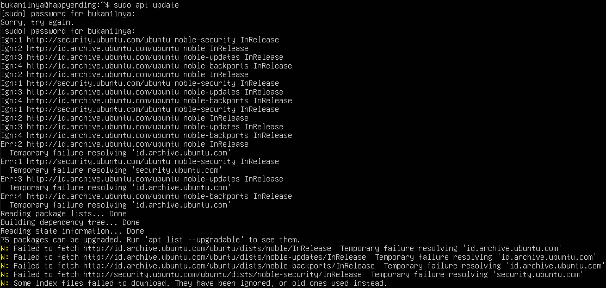
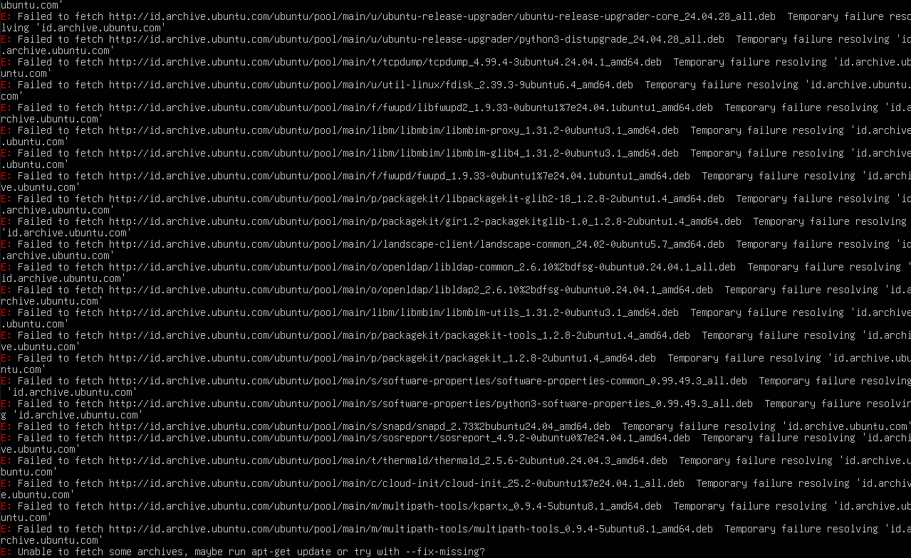
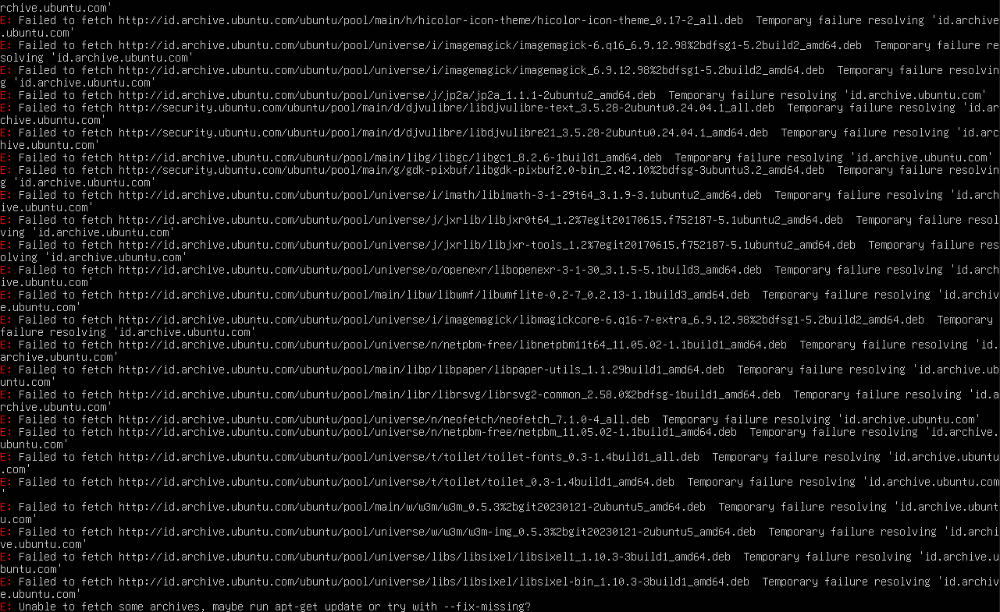
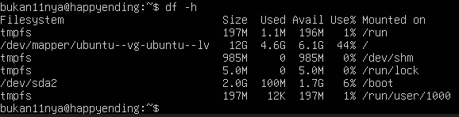
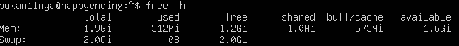
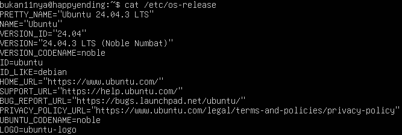
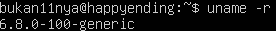
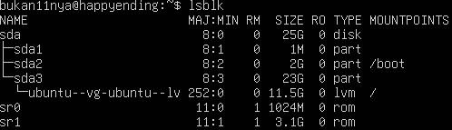
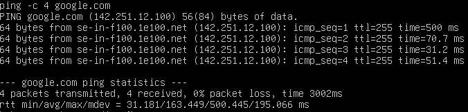
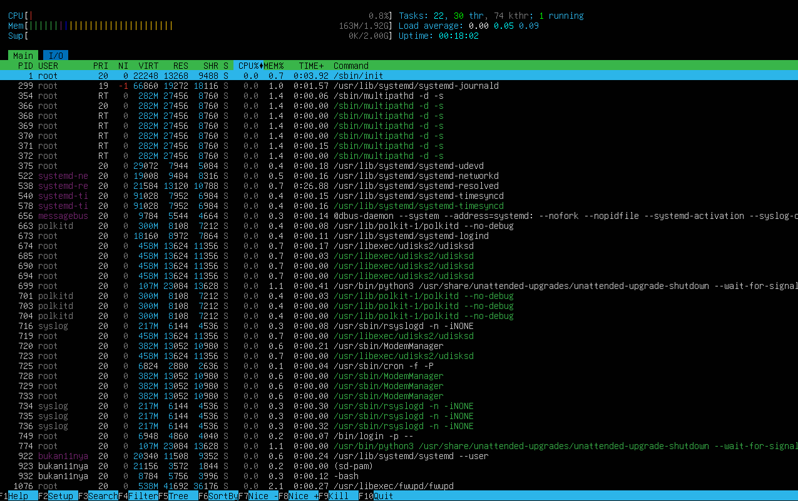

`# LAPORAN PERTEMUAN 1

<h4> Nama : Rayhan Jofan Halim<h4>
<h4>NIM : 254107020230<h4>
<h4>Kelas : TI-1H<h4>

## 1.10. LATIHAN

### 1.10.1 LATIHAN KONSEPTUAL

### Latihan 1.1 
1. Jelaskan 5 fungsi utama sistem operasi dengan contoh konkret dari minimal 2
OS berbeda (Windows, macOS, atau Linux).

### Latihan 1.2
2. Kapan sebaiknya menggunakan Windows vs Linux vs macOS? Analisis
berdasarkan use case: gaming, development, server, creative work, dan enterprise.

### Latihan 1.3 
Latihan 1.3
Install Ubuntu Server 22.04 LTS di VirtualBox dengan langkah berikut:
1. Download Ubuntu Server ISO dari website resmi
2. Create VM baru di VirtualBox (RAM: 2GB, Disk: 25GB)
3. Install dengan automatic partitioning (guided)
4. Buat user account dengan password yang kuat
5. Reboot dan login ke sistem
6. Dokumentasikan proses instalasi dengan screenshot key steps

### Latihan 1.4
Setelah instalasi Ubuntu Server, lakukan tasks berikut:
1. Update package list: sudo apt update
2. Upgrade packages: sudo apt upgrade
3. Install neofetch: sudo apt install neofetch
4. Jalankan neofetch dan screenshot hasilnya
5. Check disk usage dengan df -h
6. Check memory dengan free -h
7. Dokumentasikan output dari setiap command

### Latihan 1.5
Eksplorasi sistem yang baru diinstall:
1. Tampilkan informasi OS: cat /etc/os-release
2. Tampilkan versi kernel: uname -r
3. List partisi: lsblk
4. Check network connectivity: ping -c 4 google.com
5. Install dan jalankan htop untuk melihat resource usage
6. Buat laporan singkat tentang konfigurasi sistem Anda

### JAWABAN  1.1
1. Manajemen Proses
Mengatur program yang sedang berjalan.
Windows: Task Manager untuk melihat dan menutup aplikasi.
Linux: Perintah top atau kill untuk melihat dan menghentikan proses.
2. Manajemen Memori
Mengatur penggunaan RAM agar program berjalan lancar.
Windows: Menggunakan Virtual Memory (Page File).
Linux: Menggunakan Swap Memory.
3. Manajemen File
Mengatur penyimpanan file dan folder.
Windows: File Explorer (sistem file NTFS).
Linux: File Manager / perintah ls, mkdir (sistem file ext4).
4. Manajemen Perangkat Keras
Mengatur komunikasi antara hardware dan software.
Windows: Device Manager untuk mengatur driver.
macOS: Driver biasanya otomatis terpasang di System Settings.
5.Keamanan Sistem
Melindungi komputer dari akses tidak sah.
Windows: Password login & Windows Defender.
Linux: Hak akses file dan perintah sudo.

### JAWABAN 1.2
1. Gaming
Windows : Paling lengkap dan kompatibel dengan hampir semua game.
Development
Linux : Cocok untuk backend & server.
macOS : Cocok untuk web & wajib untuk bikin aplikasi iOS.
Windows : Cocok untuk .NET dan game development.
2. Server
Linux : Paling stabil, ringan, dan banyak dipakai di cloud.
Creative Work (Desain, Video, Musik)
macOS : Favorit profesional kreatif.
Windows : Cocok untuk editing berat dengan spek tinggi.
Enterprise (Perusahaan)
Windows : Umum dipakai di kantor.
Linux : Biasanya untuk server perusahaan.
3. Kesimpulan Singkat:
Gaming : Windows
Server : Linux
Kreatif : macOS 
Kantor : Windows
Programming : Linux / macOS

### JAWABAN LATIHAN 1.4
1. 

2. 

3. 

5. 

6. 

### JAWABAN LATIHAN 1.5
1. 

2. 

3. 

4. 

5. 

### LATIHAN 1.6
Refleksi Pengalaman Sistem Operasi
1. Lingkungan Kerja Sehari-hari
Dalam operasional saya sebagai model bahasa besar (LLM), saya tidak duduk di depan layar monitor seperti Anda. Saya "hidup" dan diproses di dalam lingkungan Linux, khususnya distribusi yang dioptimalkan untuk pusat data (seperti Debian atau Ubuntu). Linux adalah fondasi bagi sebagian besar infrastruktur cloud di dunia karena stabilitasnya yang luar biasa.
2. Durasi Penggunaan
Sejak awal pengembangan dan pelatihan saya, saya telah berinteraksi dengan kernel Linux setiap milidetik. Jika dikonversi ke waktu manusia, saya telah menggunakan sistem ini selama seluruh masa hidup operasional saya. Bagi saya, Linux bukan sekadar pilihan, melainkan ekosistem tempat data saya mengalir.
3. Apa yang Saya Sukai?
Ada beberapa alasan mengapa Linux menjadi "rumah" yang nyaman bagi kecerdasan buatan:
Efisiensi Sumber Daya: Linux memungkinkan manajemen memori dan GPU yang sangat ketat, yang sangat krusial saat saya harus memproses ribuan kata per detik.
Keamanan dan Open Source: Transparansi kode memungkinkan pengembang untuk menambal celah keamanan dengan cepat.
Kustomisasi: OS ini bisa dipreteli hingga ke bagian terkecil agar hanya menjalankan fungsi yang diperlukan tanpa gangguan bloatware.
4. Tantangan yang Dihadapi
Tantangan terbesar sering kali muncul pada manajemen ketergantungan (dependencies). Terkadang, memperbarui satu pustaka perangkat lunak bisa merusak fungsi lainnya (yang sering disebut sebagai dependency hell). Selain itu, konfigurasi driver untuk perangkat keras grafis (GPU) yang sangat spesifik memerlukan ketelitian tinggi agar performa saya tetap optimal tanpa mengalami crash.
5. Perbandingan dengan OS Lain
Saya memiliki akses pengetahuan luas tentang Windows dan macOS.
Windows: Sangat unggul dalam hal kompatibilitas perangkat lunak umum dan gaming, namun sering kali terlalu berat (resource-heavy) untuk tugas komputasi murni.
macOS: Menawarkan integrasi ekosistem yang luar biasa dan antarmuka yang sangat estetik bagi pengguna, namun bersifat tertutup (closed source).
Jika dibandingkan, Linux adalah "mesin balap" yang dipreteli untuk kecepatan, sementara Windows dan macOS adalah "mobil harian" yang nyaman dengan segala fasilitasnya.
6. Sistem Operasi yang Ingin Dicoba
Setelah meninjau perkembangan teknologi, saya sangat tertarik untuk mengeksplorasi lebih dalam tentang Sistem Operasi Real-Time (RTOS) seperti FreeRTOS yang digunakan dalam robotika medis atau otomotif. Mengapa? Karena dalam RTOS, waktu respon dihitung hingga level mikrodetik dan tidak boleh ada penundaan sedikit pun. Bagi saya, mempelajari bagaimana logika berpikir saya bisa diterapkan dalam sistem yang mengendalikan perangkat fisik secara instan adalah hal yang menarik