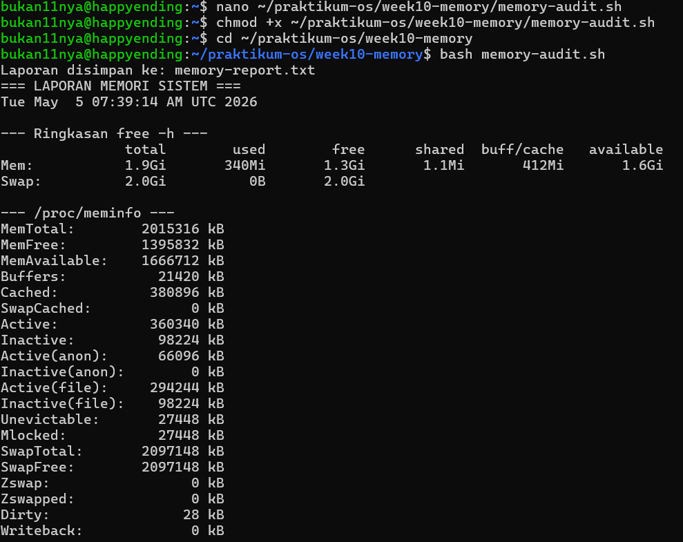
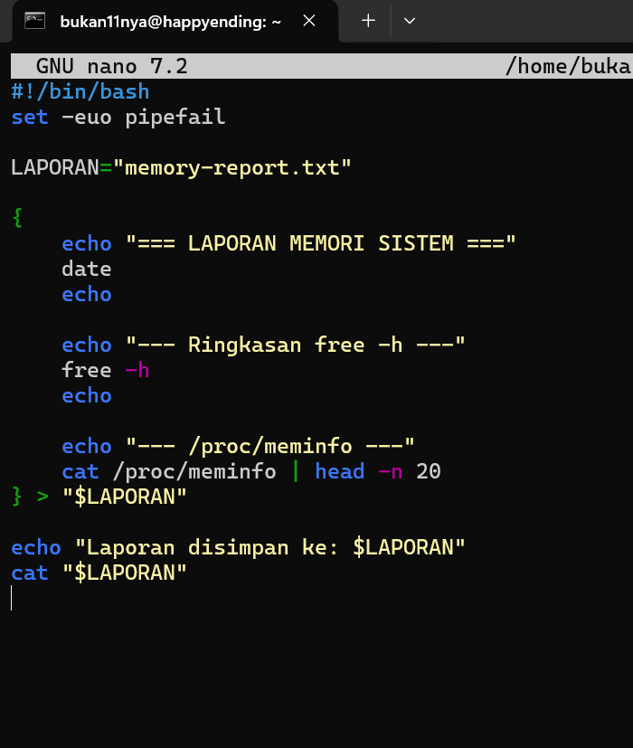
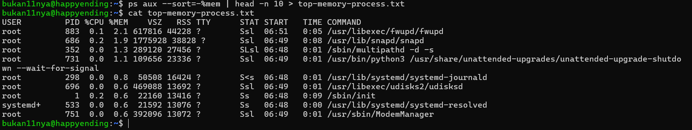
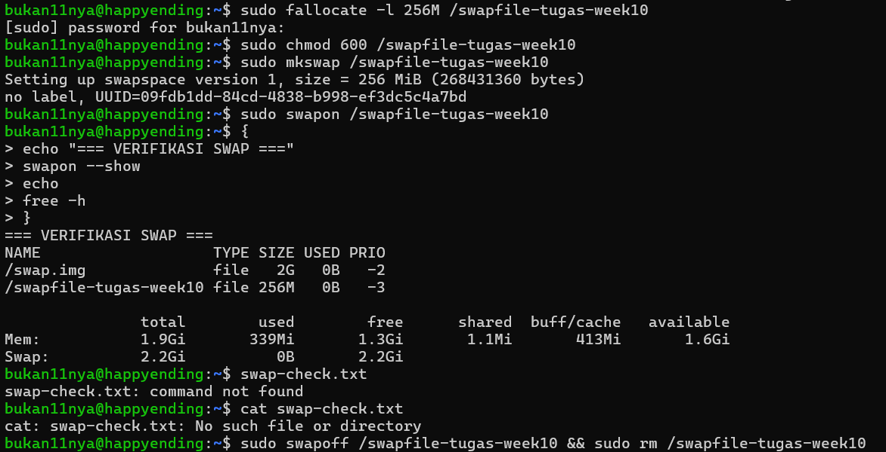
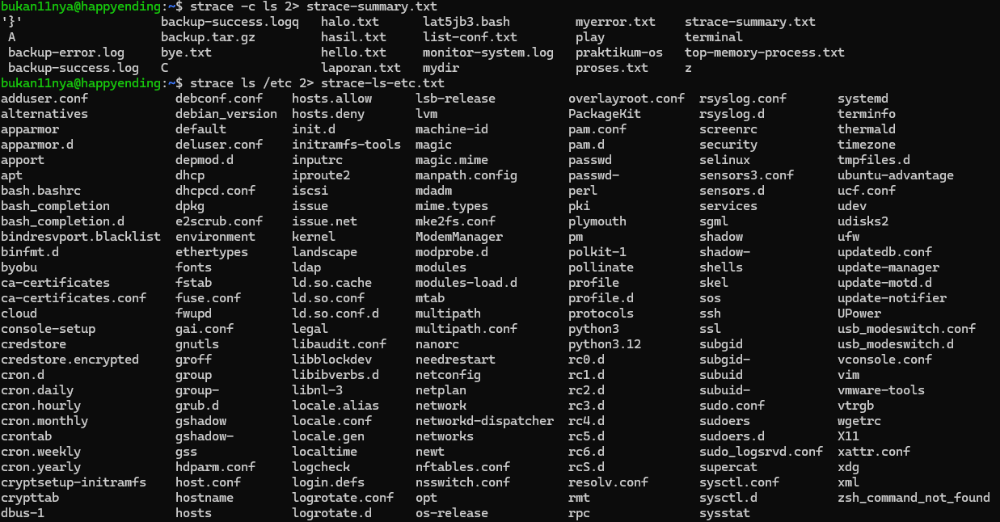
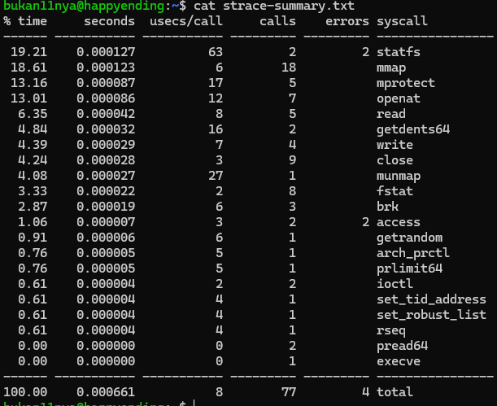
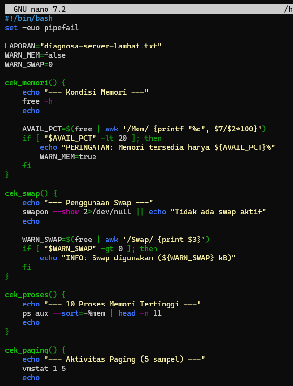
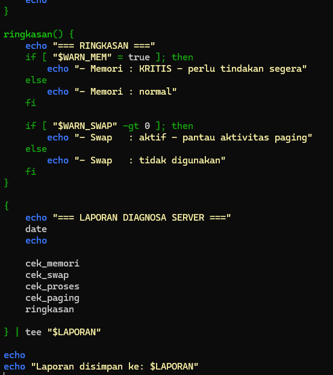
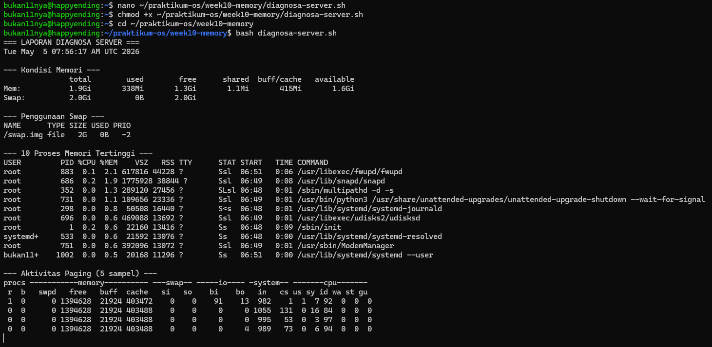

# **Laporan OS Pertemuan 10**

**Nama** : Rayhan Jofan Halim  
**NIM** : 254107020230  
**Kelas** : TI-1H  

---
## Praktikum 10.1 — Melihat Penggunaan Memori

Langkah 1 — Lihat ringkasan RAM dan swap:
```
bukan11nya@happyending:~$ mkdir -p ~/praktikum-os/week10-memory
bukan11nya@happyending:~$ free -h
               total        used        free      shared  buff/cache   available
Mem:           1.9Gi       354Mi       1.3Gi       1.1Mi       402Mi       1.6Gi
Swap:          2.0Gi          0B       2.0Gi
```
Langkah 2 — Lihat detail memori dari kernel:
```
bukan11nya@happyending:~$ cat /proc/meminfo | head -n 20
MemTotal:        2015316 kB
MemFree:         1391504 kB
MemAvailable:    1652716 kB
Buffers:           19808 kB
Cached:           373524 kB
SwapCached:            0 kB
Active:           357024 kB
Inactive:          92224 kB
Active(anon):      65760 kB
Inactive(anon):        0 kB
Active(file):     291264 kB
Inactive(file):    92224 kB
Unevictable:       27448 kB
Mlocked:           27448 kB
SwapTotal:       2097148 kB
SwapFree:        2097148 kB
Zswap:                 0 kB
Zswapped:              0 kB
Dirty:                 0 kB
Writeback:             0 kB
```

## Praktikum 10.2 — Mengamati Aktivitas Paging

### Langkah 1 — Jalankan vmstat:
```
bukan11nya@happyending:~$ vmstat 1 5
procs -----------memory---------- ---swap-- -----io---- -system-- -------cpu-------
 r  b   swpd   free   buff  cache   si   so    bi    bo   in   cs us sy id wa st gu
 1  0      0 1391504  19904 392192    0    0   300    37  976    1  1 10 88  0  0  0
 0  0      0 1391504  19904 392196    0    0     0     0 1053  144  0 21 79  0  0  0
 0  0      0 1391504  19904 392196    0    0     0     0 1048  156  0 21 79  0  0  0
 ```

## Praktikum 10.3 — Membuat dan Mengonfigurasi Swap File

Langkah 1 — Buat file 512MB sebagai swap:
```
bukan11nya@happyending:~$ sudo fallocate -l 512M /swapfile-week10
[sudo] password for bukan11nya:
```
Langkah 2 — Atur permission 600 (wajib sebelum mkswap!):
```
bukan11nya@happyending:~$ sudo chmod 600 /swapfile-week10
```
Langkah 3 — Format dan aktifkan swap:
```
bukan11nya@happyending:~$ sudo mkswap /swapfile-week10
bukan11nya@happyending:~$ sudo swapon /swapfile-week10
Setting up swapspace version 1, size = 512 MiB (536866816 bytes)
no label, UUID=c4bf49fc-d142-49bb-b184-1038c11dc34e
```
Langkah 4 — Verifikasi swap aktif:
```
bukan11nya@happyending:~$ swapon --show
NAME             TYPE SIZE USED PRIO
/swap.img        file   2G   0B   -2
/swapfile-week10 file 512M   0B   -3
bukan11nya@happyending:~$ free -h
               total        used        free      shared  buff/cache   available
Mem:           1.9Gi       352Mi       1.3Gi       1.1Mi       404Mi       1.6Gi
Swap:          2.5Gi          0B       2.5Gi
bukan11nya@happyending:~$
```

Langkah 5 — Periksa, ubah, dan verifikasi swappiness:
```
bukan11nya@happyending:~$ cat /proc/sys/vm/swappiness
60
bukan11nya@happyending:~$ sudo sysctl vm.swappiness=10
vm.swappiness = 10
bukan11nya@happyending:~$ cat /proc/sys/vm/swappiness
10
```

## Praktikum 10.4 — Monitoring Memory

Langkah 1 — Snapshot proses diurutkan dari memori terbesar:
```
bukan11nya@happyending:~$ ps aux --sort=-%mem | head
USER         PID %CPU %MEM    VSZ   RSS TTY      STAT START   TIME COMMAND
root         883  0.3  2.1 617816 44104 ?        Ssl  06:51   0:05 /usr/libexec/fwupd/fwupd
...
```

Langkah 2 — Monitoring real-time:

```
bukan11nya@happyending:~$ top
top - 07:21:16 up 33 min,  2 users,  load average: 0.18, 0.05, 0.08
Tasks: 101 total,   1 running, 100 sleeping,   0 stopped,   0 zombie
%Cpu(s):  0.0 us, 10.0 sy,  0.0 ni, 77.3 id,  0.0 wa,  0.0 hi, 12.7 si,  0.0 st
MiB Mem : 17.9/1968.1   [|||||||||||||||||                                                                            ]
MiB Swap:  0.0/2048.0   [                                                                                             ]

    PID USER      PR  NI    VIRT    RES    SHR S  %CPU  %MEM     TIME+ COMMAND
   1141 bukan11+  20   0   15100   7120   5148 S   9.0   0.4   0:07.75 sshd
   1165 root      20   0       0      0      0 I   2.1   0.0   0:29.19 kworker/0:2-events
     16 root      20   0       0      0      0 S   0.7   0.0   0:02.65 ksoftirqd/0
   1181 root      20   0       0      0      0 I   0.7   0.0   0:00.34 kworker/u2:2-events_power_efficient
   1228 bukan11+  20   0   11912   5944   3740 R   0.7   0.3   0:00.22 top
      1 root      20   0   22160  13416   9596 S   0.0   0.7   0:09.28 systemd
      2 root      20   0       0      0      0 S   0.0   0.0   0:00.00 kthreadd
      ...
```

Analisis:

1. Proses apa yang berada di urutan pertama? Catat nilai %MEM dan RSS-nya.
2. Konversikan RSS dari KB ke MB (bagi 1024). Misalnya, RSS=524288 berarti proses menggunakan 512 MB RAM. Apakah wajar untuk jenis program
tersebut?
3. Mengapa VSZ selalu lebih besar dari RSS pada proses yang sama?
4. Apakah urutan proses di ps konsisten dengan tampilan top saat diurutkan

berdasarkan %MEM?
Proses urutan pertama → catat %MEM dan RSS
Konversi RSS ke MB: RSS / 1024
Contoh: RSS=524288 → 512 MB
VSZ > RSS karena VSZ termasuk bagian yang belum dimuat ke RAM

## Praktikum 10.5 — Script Monitor Memori

Langkah 1 — Masuk ke direktori dan buat script:
```
bukan11nya@happyending:~$ cd ~/praktikum-os/week10-memory
bukan11nya@happyending:~/praktikum-os/week10-memory$ nano monitor-memori.sh
```

Langkah 2 — Ketik isi script berikut:


## Langkah 3 — Simpan (Ctrl+O → Enter → Ctrl+X), beri izin, dan jalankan:

```
bukan11nya@happyending:~/praktikum-os/week10-memory$ chmod +x monitor-memori.sh
bukan11nya@happyending:~/praktikum-os/week10-memory$ bash monitor-memori.sh
=== Monitor Memori ===
Tue May  5 07:27:42 AM UTC 2026

               total        used        free      shared  buff/cache   available
Mem:           1.9Gi       351Mi       1.3Gi       1.1Mi       405Mi       1.6Gi
Swap:          2.0Gi          0B       2.0Gi

Status: Memori tersedia 82% (normal)

--- 5 Proses Memori Tertinggi ---
root         883  0.2  2.1 617816 44104 ?        Ssl  06:51   0:05 /usr/libexec/fwupd/fwupd
root         686  0.3  1.9 1775928 38824 ?       Ssl  06:49   0:08 /usr/lib/snapd/snapd
root         352  0.0  1.3 289120 27456 ?        SLsl 06:48   0:00 /sbin/multipathd -d -s
root         731  0.0  1.1 109656 23336 ?        Ssl  06:49   0:01 /usr/bin/python3 /usr/share/unattended-upgrades/unattended-upgrade-shutdown --wait-for-signal
root         298  0.0  0.8  50508 16408 ?        S<s  06:48   0:01 /usr/lib/systemd/systemd-journald
```

## Tugas 10.1 — Audit Penggunaan Memori Sistem





Analisis:

1. Persentase memori tersedia = 5324800 / 8048576 × 100% ≈ 66% → normal
2. buff/cache tidak dihitung sebagai terpakai karena kernel bisa membebaskannya kapan saja untuk aplikasi
3. Cek SwapTotal dan SwapFree di /proc/meminfo

## Tugas 10.2 Identifikasi Proses dengan Memori Tertinggi



Analisis:

1. Proses urutan 1 → catat %MEM dan RSS
2. Konversi RSS ke MB: 65432 / 1024 ≈ 63.9 MB
3. Jumlah %MEM 5 proses teratas → total RAM yang mereka gunakan bersama

## Tugas 10.3 Membuat dan Memverifikasi Swap File



Analisis:

1. Kolom swapon --show: NAME, TYPE, SIZE, USED, PRIO
2. Baris Swap di free -h bertambah 256MB
3. Permission 600 penting: file swap bisa berisi data sensitif dari memori (password, token, dll). Jika 644 → user lain bisa membacanya!

##  Tugas 10.4 — Analisis System Call dengan strace





## Tugas 10.5 — Script Diagnosa Server Lambat





