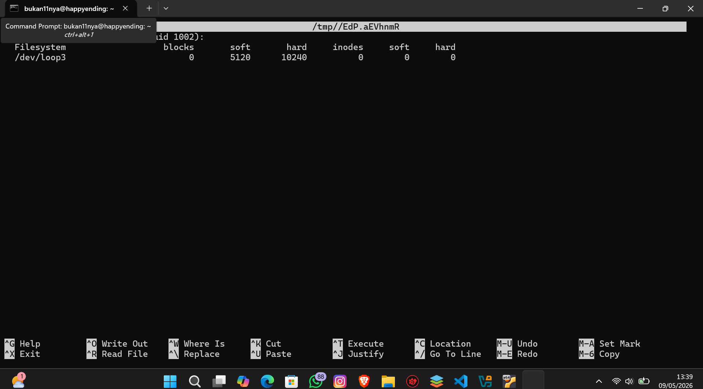

# **Laporan OS Pertemuan 11**

**Nama** : Rayhan Jofan Halim  
**NIM** : 254107020230  
**Kelas** : TI-1H  

##  Praktikum 9.1 — Permissions

Langkah 1 — Buat direktori kerja dan dua file uji:
```
bukan11nya@happyending:~$ mkdir ~/lab-permissions && cd ~/lab-permissions
bukan11nya@happyending:~/lab-permissions$ echo "data rahasia" > secret.txt
bukan11nya@happyending:~/lab-permissions$ echo '#!/bin/bash' > myscript.sh
bukan11nya@happyending:~/lab-permissions$ echo 'echo Hello' >> myscript.sh
bukan11nya@happyending:~/lab-permissions$ ls -la
total 16
drwxrwxr-x  2 bukan11nya bukan11nya 4096 May  6 02:02 .
drwxr-x--- 12 bukan11nya bukan11nya 4096 May  6 02:02 ..
-rw-rw-r--  1 bukan11nya bukan11nya   23 May  6 02:02 myscript.sh
-rw-rw-r--  1 bukan11nya bukan11nya   13 May  6 02:02 secret.txt
```

Langkah 2 — Jadikan secret.txt privat hanya untuk owner & Langkah 3 — Jadikan myscript.sh dapat dijalankan:
```
bukan11nya@happyending:~/lab-permissions$ chmod 600 secret.txt
bukan11nya@happyending:~/lab-permissions$ ls -l secret.txt
-rw------- 1 bukan11nya bukan11nya 13 May  6 02:02 secret.txt
bukan11nya@happyending:~/lab-permissions$ chmod 755 myscript.sh
bukan11nya@happyending:~/lab-permissions$ ls -l myscript.sh
-rwxr-xr-x 1 bukan11nya bukan11nya 23 May  6 02:02 myscript.sh
bukan11nya@happyending:~/lab-permissions$ ./myscript.sh
Hello
```

Langkah 4 — Buat direktori bersama dan amati efek SGID & Langkah 5 — Uji efek umask pada file baru:
```
bukan11nya@happyending:~/lab-permissions$ mkdir shared-dir
bukan11nya@happyending:~/lab-permissions$ chmod g+s shared-dir
bukan11nya@happyending:~/lab-permissions$ ls -ld shared-dir
drwxrwsr-x 2 bukan11nya bukan11nya 4096 May  6 02:06 shared-dir
bukan11nya@happyending:~/lab-permissions$ umask
0002
bukan11nya@happyending:~/lab-permissions$ umask 027
bukan11nya@happyending:~/lab-permissions$ touch testfile-027
bukan11nya@happyending:~/lab-permissions$ ls -l testfile-027
-rw-r----- 1 bukan11nya bukan11nya 0 May  6 02:08 testfile-027
```

Analisis:

1. chmod 600 menghilangkan semua bit r/w/x untuk group dan others
2. 600 = privat (owner saja), 755 = publik (semua bisa baca+eksekusi)
3. umask 027 menghasilkan 640 untuk file, bukan 777 karena umask adalah pengurang dari default (666 - 027 = 640)

##  Praktikum 9.2 — ACL 

Langkah 1 — Siapkan file dan lihat permission standar:

```
bukan11nya@happyending:~$ mkdir ~/lab-acl && cd ~/lab-acl
ukan11nya@happyending:~$ echo "Data penting" > confidential.txt
bukan11nya@happyending:~$ chmod 640 confidential.txt
bukan11nya@happyending:~$ ls -l confidential.txt
-rw-r----- 1 bukan11nya bukan11nya 13 May  6 02:20 confidential.txt
bukan11nya@happyending:~$ getfacl confidential.txt
# file: confidential.txt
# owner: bukan11nya
# group: bukan11nya
user::rw-
group::r--
``` 

## Latihan 9.A — Audit dan Kolaborasi

### Soal 1 — Temukan file SUID aktif:

```
bukan11nya@happyending:~$ find / -perm -4000 -type f 2>/dev/null
/usr/bin/newgrp
/usr/bin/sudo
/usr/bin/chsh
/usr/bin/mount
/usr/bin/su
/usr/bin/umount
/usr/bin/passwd
```

Analisis:
/usr/bin/passwd    ← perlu tulis ke /etc/shadow yang hanya bisa root
/usr/bin/sudo      ← perlu jalankan perintah sebagai root
/usr/bin/su        ← perlu berpindah identitas user

### Soal 2 — Cari direktori world-writable:

```
bukan11nya@happyending:~$ find / -type d -perm -002 2>/dev/null
/var/crash
/var/tmp
/run/screen
/run/lock
/dev/mqueue
/dev/shm
/snap/core20/2717/run/lock
/snap/core20/2717/tmp
/snap/core20/2717/var/tmp
/snap/core20/2769/run/lock
/snap/core20/2769/tmp
/snap/core20/2769/var/tmp
/tmp
/tmp/.X11-unix
/tmp/.ICE-unix
/tmp/.XIM-unix
/tmp/.font-unix
```

Analisis:
/tmp          → VALID: direktori sementara, ada sticky bit (1777)
/var/tmp      → VALID: direktori sementara dengan sticky bit
/srv/uploads  → BERISIKO jika tidak ada sticky bit! Semua user bisa hapus file orang lain


### Soal 3 — Rancang permission /srv/webapp/:
```
bukan11nya@happyending:~$ sudo mkdir -p /srv/webapp
[sudo] password for bukan11nya:
bukan11nya@happyending:~$ sudo groupadd webapp-team
bukan11nya@happyending:~$ sudo useradd -m deploy
bukan11nya@happyending:~$ sudo chown root:webapp-team /srv/webapp
bukan11nya@happyending:~$ sudo chmod 2770 /srv/webapp
bukan11nya@happyending:~$ sudo setfacl -d -m g:webapp-team:rwx /srv/webapp
bukan11nya@happyending:~$ sudo setfacl -d -m u:deploy:r-x /srv/webapp
bukan11nya@happyending:~$ ls -ld /srv/webapp
drwxrws---+ 2 root webapp-team 4096 May  6 02:35 /srv/webapp
bukan11nya@happyending:~$ getfacl /srv/webapp
getfacl: Removing leading '/' from absolute path names
# file: srv/webapp
# owner: root
# group: webapp-team
# flags: -s-
user::rwx
group::rwx
other::---
default:user::rwx
default:user:deploy:r-x
default:group::rwx
default:group:webapp-team:rwx
default:mask::rwx
default:other::---
```

## Latihan 9.B — Kebijakan Akun dan Quota

```
bukan11nya@happyending:~$ sudo useradd -m -s /bin/bash intern
[sudo] password for bukan11nya:
Sorry, try again.
[sudo] password for bukan11nya:
bukan11nya@happyending:~$ sudo passwd intern
New password:
Retype new password:
Sorry, passwords do not match.
passwd: Authentication token manipulation error
passwd: password unchanged
bukan11nya@happyending:~$ sudo groupadd labgroup   # jika belum ada
bukan11nya@happyending:~$ sudo usermod -aG labgroup intern
bukan11nya@happyending:~$ id intern
uid=1002(intern) gid=1003(intern) groups=1003(intern),1004(labgroup)
bukan11nya@happyending:~$ sudo chage -M 45 -W 7 intern
bukan11nya@happyending:~$ sudo chage -d 0 intern
bukan11nya@happyending:~$ sudo chage -l intern
Last password change                                    : password must be changed
Password expires                                        : password must be changed
Password inactive                                       : password must be changed
Account expires                                         : never
Minimum number of days between password change          : 0
Maximum number of days between password change          : 45
Number of days of warning before password expires       : 7
bukan11nya@happyending:~$ sudo visudo -f /etc/sudoers.d/intern
bukan11nya@happyending:~$ sudo -l -U intern
Matching Defaults entries for intern on happyending:
    env_reset, mail_badpass,
    secure_path=/usr/local/sbin\:/usr/local/bin\:/usr/sbin\:/usr/bin\:/sbin\:/bin\:/snap/bin,
    use_pty

User intern may run the following commands on happyending:
    (root) /bin/systemctl status *
bukan11nya@happyending:~$ mount | grep quota-test
/tmp/quota-test.img on /mnt/quota-test type ext4 (rw,relatime,quota,usrquota,grpquota)
bukan11nya@happyending:~$ sudo edquota -u intern


bukan11nya@happyending:~$ sudo repquota /mnt/quota-test
*** Report for user quotas on device /dev/loop3
Block grace time: 7days; Inode grace time: 7days
                        Block limits                File limits
User            used    soft    hard  grace    used  soft  hard  grace
----------------------------------------------------------------------
root      --      20       0       0              2     0     0


bukan11nya@happyending:~$ sudo repquota /mnt/quota-test
*** Report for user quotas on device /dev/loop3
Block grace time: 7days; Inode grace time: 7days
                        Block limits                File limits
User            used    soft    hard  grace    used  soft  hard  grace
----------------------------------------------------------------------
root      --      20       0       0              2     0     0


bukan11nya@happyending:~$ sudo edquota -u intern
bukan11nya@happyending:~$ echo "=== INFO USER INTERN ==="
=== INFO USER INTERN ===
bukan11nya@happyending:~$ id intern
uid=1002(intern) gid=1003(intern) groups=1003(intern),1004(labgroup)
bukan11nya@happyending:~$ echo ""

bukan11nya@happyending:~$ echo "=== AGING POLICY ==="
=== AGING POLICY ===
bukan11nya@happyending:~$ sudo chage -l intern
Last password change                                    : password must be changed
Password expires                                        : password must be changed
Password inactive                                       : password must be changed
Account expires                                         : never
Minimum number of days between password change          : 0
Maximum number of days between password change          : 45
Number of days of warning before password expires       : 7
bukan11nya@happyending:~$ echo ""

bukan11nya@happyending:~$ echo "=== HAK SUDO ==="
=== HAK SUDO ===
bukan11nya@happyending:~$ sudo -l -U intern
Matching Defaults entries for intern on happyending:
    env_reset, mail_badpass,
    secure_path=/usr/local/sbin\:/usr/local/bin\:/usr/sbin\:/usr/bin\:/sbin\:/bin\:/snap/bin,
    use_pty

User intern may run the following commands on happyending:
    (root) /bin/systemctl status *
bukan11nya@happyending:~$ echo ""

bukan11nya@happyending:~$ echo "=== QUOTA ==="
=== QUOTA ===
bukan11nya@happyending:~$ sudo repquota /mnt/quota-test
*** Report for user quotas on device /dev/loop3
Block grace time: 7days; Inode grace time: 7days
                        Block limits                File limits
User            used    soft    hard  grace    used  soft  hard  grace
----------------------------------------------------------------------
root      --      20       0       0              2     0     0

```

