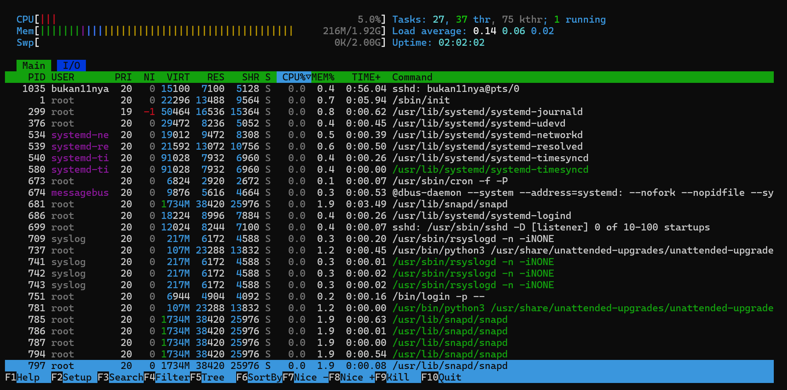

# LAPORAN PERTEMUAN 6

<h4> Nama : Rayhan Jofan Halim<h4>
<h4>NIM : 254107020230<h4>
<h4>Kelas : TI-1H<h4>

Praktikum 6.1 — Melihat Proses dan Thread
1. Tampilkan semua proses yang berjalan:
```ps aux```
bukan11nya@happyending:~$ ps aux
```
USER         PID %CPU %MEM    VSZ   RSS TTY      STAT START   TIME COMMAND
root           1  0.9  0.6  22028 13356 ?        Ss   05:04   0:01 /sbin/init
root           2  0.0  0.0      0     0 ?        S    05:04   0:00 [kthreadd]
root           3  0.0  0.0      0     0 ?        S    05:04   0:00 [pool_workqueue_release]
root           4  0.0  0.0      0     0 ?        I<   05:04   0:00 [kworker/R-rcu_g]
root           5  0.0  0.0      0     0 ?        I<   05:04   0:00 [kworker/R-rcu_p]
root           6  0.0  0.0      0     0 ?        I<   05:04   0:00 [kworker/R-slub_]
root           7  0.0  0.0      0     0 ?        I<   05:04   0:00 [kworker/R-netns]
root           8  0.3  0.0      0     0 ?        I    05:04   0:00 [kworker/0:0-cgroup_destroy]
root           9  0.0  0.0      0     0 ?        I    05:04   0:00 [kworker/0:1-events]
root          10  0.0  0.0      0     0 ?        I<   05:04   0:00 [kworker/0:0H-kblockd]
root          11  0.1  0.0      0     0 ?        I    05:04   0:00 [kworker/u2:0-events_unbound]
...
```
Kode 1.1: Menampilkan semua proses
2. Tampilkan proses beserta thread-nya, dapat dilihat pada kolom LWP (LightWeight Process ID):
```ps aux -L```
```
bukan11nya@happyending:~$ ps aux -L
USER         PID     LWP %CPU NLWP %MEM    VSZ   RSS TTY      STAT START   TIME COMMAND
root           1       1  0.6    1  0.6  22028 13356 ?        Ss   05:04   0:01 /sbin/init
root           2       2  0.0    1  0.0      0     0 ?        S    05:04   0:00 [kthreadd]
root           3       3  0.0    1  0.0      0     0 ?        S    05:04   0:00 [pool_workqueue_release]
root           4       4  0.0    1  0.0      0     0 ?        I<   05:04   0:00 [kworker/R-rcu_g]
root           5       5  0.0    1  0.0      0     0 ?        I<   05:04   0:00 [kworker/R-rcu_p]
root           6       6  0.0    1  0.0      0     0 ?        I<   05:04   0:00 [kworker/R-slub_]
root           7       7  0.0    1  0.0      0     0 ?        I<   05:04   0:00 [kworker/R-netns]
root           8       8  0.2    1  0.0      0     0 ?        I    05:04   0:00 [kworker/0:0-cgroup_destroy]
root           9       9  0.0    1  0.0      0     0 ?        I    05:04   0:00 [kworker/0:1-events]
root          10      10  0.0    1  0.0      0     0 ?        I<   05:04   0:00 [kworker/0:0H-kblockd]
root          11      11  0.1    1  0.0      0     0 ?        I    05:04   0:00 [kworker/u2:0-events_unbound]
...
root         988     988  0.0    1  0.5  14968 10636 ?        Ss   05:06   0:00 sshd: bukan11nya [priv]
bukan11+    1046    1046  0.4    1  0.3  15100  7132 ?        S    05:06   0:00 sshd: bukan11nya@pts/0
bukan11+    1047    1047  0.0    1  0.2   8648  5652 pts/0    Ss   05:06   0:00 -bash
bukan11+    1058    1058  100    1  0.2  11012  4588 pts/0    R+   05:08   0:00 ps aux -L
```
Kode 1.2: Menampilkan proses dengan thread
3. Lihat PID shell aktif dan detail prosesnya:
```echo $$```
```ps -p $$ -f```
Kode 1.3: Detail proses shell saat ini
```
bukan11nya@happyending:~$ echo $$
1036
bukan11nya@happyending:~$ ps -p $$ -f
UID          PID    PPID  C STIME TTY          TIME CMD
bukan11+    1036    1035  0 06:43 pts/0    00:00:00 -bash
```
4. Lihat hierarki proses secara visual:
```pstree -p```
Kode 1.4: Pohon proses
```
bukan11nya@happyending:~$ pstree -p
systemd(1)─┬─ModemManager(733)─┬─{ModemManager}(757)
           │                   ├─{ModemManager}(761)
           │                   └─{ModemManager}(764)
           ├─cron(673)
           ├─dbus-daemon(674)
           ├─login(751)───bash(966)
           ├─multipathd(354)─┬─{multipathd}(365)
           │                 ├─{multipathd}(366)
           │                 ├─{multipathd}(367)
           │                 ├─{multipathd}(368)
           │                 ├─{multipathd}(369)
           │                 └─{multipathd}(370)
           ├─polkitd(678)─┬─{polkitd}(717)
           │              ├─{polkitd}(719)
           │              └─{polkitd}(720)
           ├─rsyslogd(709)─┬─{rsyslogd}(741)
           │               ├─{rsyslogd}(742)
           │               └─{rsyslogd}(743)
           ├─snapd(681)─┬─{snapd}(785)
           │            ├─{snapd}(786)
           │            ├─{snapd}(787)
           │            ├─{snapd}(794)
           │            ├─{snapd}(797)
           │            └─{snapd}(798)
           ├─sshd(699)───sshd(979)───sshd(1035)───bash(1036)───pstree(1049)
           ├─systemd(954)───(sd-pam)(955)
           ├─systemd-journal(299)
           ├─systemd-logind(686)
           ├─systemd-network(534)
           ├─systemd-resolve(539)
           ├─systemd-timesyn(540)───{systemd-timesyn}(580)
           ├─systemd-udevd(376)
           ├─udisksd(688)─┬─{udisksd}(710)
           │              ├─{udisksd}(711)
           │              ├─{udisksd}(714)
           │              ├─{udisksd}(730)
           │              └─{udisksd}(738)
           └─unattended-upgr(737)───{unattended-upgr}(781)
```
### LATIHAN 6.1

Jalankan ps aux dan amati outputnya:

1. Berapa total proses yang berjalan? Proses apa yang memiliki PID
terkecil?
```
bukan11nya@happyending:~$ ps aux | wc -l
107
```
berarti ada 107 proses yang berjalan
proses yang memiliki PID terkecil di komputer saya
```
bukan11nya@happyending:~$ ps aux
USER         PID %CPU %MEM    VSZ   RSS TTY      STAT START   TIME COMMAND
root           1  1.4  0.6  22120 13304 ?        Ss   04:06   0:03 /sbin/init
```
2. Jalankan pstree -p dan temukan proses bash Anda. Proses apa yang
menjadi induk (PPID) dari bash tersebut?
```─sshd(699)───sshd(979)───sshd(1035)───bash(1036)───pstree(1049)```
3. Bandingkan output ps aux dan ps aux -L. Apa perbedaan yang Anda
lihat?
Jawab :

Perbedaan nya dari tampilan nya kalau ps aux menampilkan daftar proses saja dan setiap baris  terdapat satu proses saja kalau ps aux -L menampilkan proses dengan threadnya serta satu proses bisa muncul beberapa baris

### Praktikum 6.2 — Mengamati Siklus Hidup Proses
1. Buat proses di background dan amati kondisinya:
sleep 60 &
ps aux | grep sleep
Kode 1.5: Mengamati kondisi proses
```
bukan11nya@happyending:~$ sleep 60 &
ps aux | grep sleep
[2] 1067
bukan11+    1066  0.0  0.1   5684  2104 pts/0    S    06:53   0:00 sleep 60
bukan11+    1067  0.0  0.1   5684  2104 pts/0    S    06:53   0:00 sleep 60
bukan11+    1069  0.0  0.1   6544  2328 pts/0    S+   06:53   0:00 grep --color=auto sleep
```
2. Amati perubahan exit code dari perintah yang berhasil dan gagal:
```ls / tmp```
```echo " Sukses : $?"```
```ls / direktori - tidak - ada```
```echo " Gagal : $?"```
Kode 1.6: Mengamati exit code
```
bukan11nya@happyending:~$ ls /tmp
snap-private-tmp
systemd-private-ac064fc9fabc4c3b8a6f14fa0dad0e3c-ModemManager.service-eC1XzS
systemd-private-ac064fc9fabc4c3b8a6f14fa0dad0e3c-polkit.service-VKf6gs
systemd-private-ac064fc9fabc4c3b8a6f14fa0dad0e3c-systemd-logind.service-rWA4Nx
systemd-private-ac064fc9fabc4c3b8a6f14fa0dad0e3c-systemd-resolved.service-z1huJR
systemd-private-ac064fc9fabc4c3b8a6f14fa0dad0e3c-systemd-timesyncd.service-hk9SdI
bukan11nya@happyending:~$ echo "Sukses: $?"
Sukses: 0
[1]-  Done                    sleep 60
[2]+  Done                    sleep 60
bukan11nya@happyending:~$ ls /direktori-tidak-ada
ls: cannot access '/direktori-tidak-ada': No such file or directory
bukan11nya@happyending:~$ echo "Gagal: $?"kondisi sleep 120 adalah S artinya proses sedang tidur
Gagal: 2
```

### Latihan 6.2
1. Jalankan sleep 120 & dan amati kolom STAT pada ps aux. Kondisi
apa yang ditampilkan? Mengapa proses sleep berada di kondisi tersebut?
kondisi sleep 120 adalah S, artinya proses sedang tidur. Proses sleep berada pada kondisi “S” (sleeping), yaitu keadaan di mana proses sedang menunggu tanpa menggunakan CPU. Hal ini karena perintah sleep hanya menunda eksekusi selama waktu tertentu, sehingga tidak memerlukan aktivitas pemrosesan.
2. Jalankan beberapa perintah yang berhasil dan yang gagal, lalu catat exit
code masing-masing. Pola apa yang Anda temukan?
bukan11nya@happyending:~$ echo $?
0 -> berhasil
bukan11nya@happyending:~$ ls file-tidak-ada
ls: cannot access 'file-tidak-ada': No such file or directory
bukan11nya@happyending:~$ echo $?
2 -> perintah gagal
bukan11nya@happyending:~$ abc123
abc123: command not found
bukan11nya@happyending:~$ echo $?
127 -> perintah tidak ditemukan atau salah

### Praktikum 6.3 — Mengatur Prioritas Proses
1. Jalankan proses dengan prioritas rendah:
```nice -n 10 sleep 300 &```
Kode 1.8: Menjalankan proses dengan nice +10
```
bukan11nya@happyending:~$ nice -n 10 sleep 300 &
[1] 2514
```
2. Verifikasi nilai nice pada kolom NI:
```ps aux | grep sleep```
Kode 1.9: Melihat nilai nice
```
bukan11nya@happyending:~$ ps aux | grep sleep
bukan11+    2514  0.0  0.1   5684  2104 pts/0    SN   07:22   0:00 sleep 300
bukan11+    2565 12.5  0.1   6544  2332 pts/0    S+   07:23   0:00 grep --color=auto sleep
```

3. Ubah nilai nice proses yang sudah berjalan:
```renice -n 15 -p <PID >```
```ps -p <PID > -o pid , ni , cmd```
Kode 1.10: Mengubah nice dengan renice
```
bukan11nya@happyending:~$ renice -n 15 -p 2514
2514 (process ID) old priority 10, new priority 15
bukan11nya@happyending:~$ ps -p 2514 -o pid,ni,cmd
    PID  NI CMD
   2514  15 sleep 300
   ```
4. Bersihkan proses percobaan:
```kill %1```
Kode 1.11: Menghentikan proses percobaan
```
bukan11nya@happyending:~$ kill %1
-bash: kill: (2514) - No such process
[1]+  Done                    nice -n 10 sleep 300
```

### Latihan 6.3
1. Jalankan nice -n 5 sleep 200 & dan verifikasi nilai NI-nya dengan
ps.
```
bukan11nya@happyending:~$ nice -n 5 sleep 200 &
[1] 12559
bukan11nya@happyending:~$ ps aux | grep sleep
bukan11+   12559  0.0  0.1   5684  2104 pts/0    SN   07:29   0:00 sleep 200
bukan11+   12566  0.0  0.1   6544  2328 pts/0    S+   07:32   0:00 grep --color=auto sleep
```
2. Ubah nilai nice menjadi 10 menggunakan renice, lalu verifikasi kembali.
```
bukan11nya@happyending:~$ nice -n 5 sleep 200 &
[2] 12596
[1]   Done                    nice -n 5 sleep 200
bukan11nya@happyending:~$ ps aux | grep sleep
bukan11+   12596  0.1  0.1   5684  2104 pts/0    SN   07:33   0:00 sleep 200
bukan11+   12598  0.0  0.1   6544  2328 pts/0    S+   07:33   0:00 grep --color=auto sleep
```
3. Coba ubah nilai nice menjadi -5 tanpa sudo. Apa yang terjadi? Mengapa
Linux membatasi hal ini untuk user biasa?
```
bukan11nya@happyending:~$ nice -n 5 sleep 200 &
[1] 12617
bukan11nya@happyending:~$ renice -5 -p 12617
renice: failed to set priority for 12617 (process ID): Permission denied
```
Kenapa tidak bisa
bilai nice negatif = prioritas tinggi
bisa " mengganggu " sistem jika disalahgunakan
linuc=x membatasi ini hanya untuk sudo

### Paktikum 6.4 — Mengirim Sinyal ke Proses
1. Buat proses percobaan:
sleep 500 &
sleep 600 &
sleep 700 &
ps aux | grep -v grep | grep sleep
Kode 1.13: Membuat proses percobaan
```
bukan11nya@happyending:~$ sleep 500 &
[1] 12730
bukan11nya@happyending:~$ sleep 600 &
[2] 12731
bukan11nya@happyending:~$ sleep 700 &
[3] 12732
bukan11nya@happyending:~$ ps aux | grep -v grep | grep sleep
bukan11+   12730  0.0  0.1   5684  2104 pts/0    S    07:44   0:00 sleep 500
bukan11+   12731  0.0  0.1   5684  2104 pts/0    S    07:44   0:00 sleep 600
bukan11+   12732  0.0  0.1   5684  2108 pts/0    S    07:44   0:00 sleep 700
```
2. Hentikan satu proses dengan SIGTERM dan verifikasi:
kill <PID - sleep -500 >
ps aux | grep -v grep | grep sleep
Kode 1.14: Menghentikan proses dengan SIGTERM
```
bukan11nya@happyending:~$ kill 12730 - sleep -500
-bash: kill: -: arguments must be process or job IDs
-bash: kill: sleep: arguments must be process or job IDs
-bash: kill: (-500) - No such process
bukan11nya@happyending:~$ ps aux | grep -v grep | grep sleep
bukan11+   12731  0.0  0.1   5684  2104 pts/0    S    07:44   0:00 sleep 600
bukan11+   12732  0.0  0.1   5684  2108 pts/0    S    07:44   0:00 sleep 700
[1]   Terminated              sleep 500
```
3. Jeda dan lanjutkan proses dengan SIGSTOP/SIGCONT:
kill - SIGSTOP <PID - sleep -600 >
ps aux | grep sleep # amati kolom STAT : berubah
menjadi T
kill - SIGCONT <PID - sleep -600 >
ps aux | grep sleep # STAT kembali ke S
Kode 1.15: Menjeda dan melanjutkan proses
```
bukan11nya@happyending:~$ kill -SIGSTOP 12731
bukan11nya@happyending:~$ ps aux | grep sleep
bukan11+   12731  0.0  0.1   5684  2104 pts/0    T    07:44   0:00 sleep 600
bukan11+   12732  0.0  0.1   5684  2108 pts/0    S    07:44   0:00 sleep 700
bukan11+   12755 33.3  0.1   6544  2328 pts/0    S+   07:49   0:00 grep --color=auto sleep
```
```
bukan11nya@happyending:~$ kill -SIGCONT 12731
bukan11nya@happyending:~$ ps aux | grep sleep
bukan11+   12731  0.0  0.1   5684  2104 pts/0    S    07:44   0:00 sleep 600
bukan11+   12732  0.0  0.1   5684  2108 pts/0    S    07:44   0:00 sleep 700
bukan11+   12762 33.3  0.1   6544  2332 pts/0    S+   07:51   0:00 grep --color=auto sleep
```
[2]+  Stopped                 sleep 600
4. Hentikan semua proses sleep sekaligus:
pkill sleep
Kode 1.16: Menghentikan semua proses sleep
```
bukan11nya@happyending:~$ pkill sleep
[2]-  Terminated              sleep 600
[3]+  Terminated              sleep 700
```
### LATIHAN 6.4
1. Jalankan sleep 400 &, kirim SIGSTOP, dan amati perubahan kolom
STAT. Kondisi apa yang muncul?
```
bukan11nya@happyending:~$ sleep 400 &
[1] 12767
bukan11nya@happyending:~$ ps aux | grep sleep
bukan11+   12767  0.0  0.1   5684  2108 pts/0    S    07:54   0:00 sleep 400
bukan11+   12769  0.0  0.1   6544  2332 pts/0    S+   07:54   0:00 grep --color=auto sleep
bukan11nya@happyending:~$ ps aux | grep sleep | grep -v grep
bukan11+   12767  0.0  0.1   5684  2108 pts/0    S    07:54   0:00 sleep 400
bukan11nya@happyending:~$ kill -SIGSTOP 12767
bukan11nya@happyending:~$ ps aux | grep sleep | grep -v grep
bukan11+   12767  0.0  0.1   5684  2108 pts/0    T    07:54   0:00 sleep 400
[1]+  Stopped                 sleep 400
```
2. Kirim SIGCONT dan verifikasi proses kembali berjalan.
```
bukan11nya@happyending:~$ kill -SIGCONT 12767
bukan11nya@happyending:~$ ps aux | grep sleep | grep -v grep
bukan11+   12767  0.0  0.1   5684  2108 pts/0    S    07:54   0:00 sleep 400
```
3. Hentikan proses dengan SIGTERM lalu verifikasi sudah tidak ada. Kapan
Anda memilih SIGKILL daripada SIGTERM?
```
bukan11nya@happyending:~$ kill -SIGTERM 12767
bukan11nya@happyending:~$ ps aux | grep sleep | grep -v grep
[1]+  Terminated              sleep 400
```
Kapan saat kita menggunakan SIGKILL atau SIGTERM : 
SIGKILL digunakan ketika proses tidak merespon terhadap SIGTERM atau dalam kondisi hang. SIGKILL akan langsung menghentikan proses secara paksa tanpa memberikan kesempatan untuk melakukan pembersihan, sehingga penggunaannya sebaiknya menjadi pilihan terakhir.

### Praktikum 6.5 — Manajemen Job Foreground dan
Background
1. Jalankan tiga job di background:
sleep 200 &
sleep 300 &
sleep 400 &
jobs
Kode 1.17: Membuat tiga job di background
```
bukan11nya@happyending:~$ sleep 200 &
[1] 12797
bukan11nya@happyending:~$ sleep 300 &
[2] 12800
bukan11nya@happyending:~$ sleep 400 &
[3] 12801
bukan11nya@happyending:~$ jobs
[1]   Running                 sleep 200 &
[2]-  Running                 sleep 300 &
[3]+  Running                 sleep 400 &
```
2. Bawa job pertama ke foreground, jeda, lalu kembalikan ke background:
fg %1
Tekan Ctrl +Z untuk menjeda
bg %1
jobs
Kode 1.18: Memindahkan job antar foreground-background
```
bukan11nya@happyending:~$ fg %1
sleep 200
^Z
[1]+  Stopped                 sleep 200
bukan11nya@happyending:~$ bg %1
[1]+ sleep 200 &
bukan11nya@happyending:~$ jobs
[1]   Running                 sleep 200 &
[2]-  Running                 sleep 300 &
[3]+  Running                 sleep 400 &
```
3. Hentikan semua job:
kill %1 %2 %3
jobs
Kode 1.19: Menghentikan semua job
```
bukan11nya@happyending:~$ kill %1 %2 %3
-bash: kill: (12797) - No such process
[1]   Done                    sleep 200
bukan11nya@happyending:~$ jobs
[2]-  Terminated              sleep 300
[3]+  Terminated              sleep 400
```

### Latihan 6.5
1. Jalankan top di foreground. Apa yang terjadi di terminal?
```
bukan11nya@happyending:~$ sleep 400 &
[1] 12824
bukan11nya@happyending:~$ ps aux | grep sleep | grep -v grep
bukan11+   12824  0.0  0.1   5684  2108 pts/0    S    08:18   0:00 sleep 400
bukan11nya@happyending:~$ kill -SIGSTOP 12824
bukan11nya@happyending:~$ ps aux | grep sleep | grep -v grep
bukan11+   12824  0.0  0.1   5684  2108 pts/0    T    08:18   0:00 sleep 400
Saat menjalankan perintah top di foreground, terminal menampilkan informasi sistem secara real-time dan tidak dapat digunakan untuk menjalankan perintah lain sampai proses dihentikan.
[1]+  Stopped                 sleep 400
```
2. Tekan Ctrl+Z dan cek statusnya dengan jobs. Kondisi apa yang
ditampilkan?
```
bukan11nya@happyending:~$ jobs
[1]+  Stopped                 sleep 400
```
Setelah menekan Ctrl+Z, proses top dihentikan sementara dengan status “Stopped” yang dapat dilihat melalui perintah jobs.
3. Pindahkan ke background dengan bg. Apakah top dapat berjalan dengan
baik di background? Mengapa?
```
bukan11nya@happyending:~$ bg
[1]+ sleep 400 &
```
Setelah dijalankan dengan perintah bg, proses top berjalan di background namun tidak berfungsi dengan baik karena membutuhkan interaksi langsung dengan terminal untuk menampilkan informasi secara real-time.
4. Kembalikan ke foreground dengan fg, lalu keluar dengan q .
bukan11nya@happyending:~$ fg
-bash: fg: job has terminated
[1]+  Done                    sleep 400
Dengan perintah fg, proses top dikembalikan ke foreground sehingga dapat berfungsi normal kembali. Proses kemudian dapat dihentikan dengan menekan tombol q.

Praktikum 6.6 — Pemantauan Proses
1. Temukan proses dengan penggunaan CPU dan memori tertinggi:
ps aux -- sort = -% cpu | head -10
ps aux -- sort = -% mem | head -10
Kode 1.22: Proses dengan resource tertinggi
```
bukan11nya@happyending:~$ ps aux -- sort = -% cpu | head -10
error: garbage option

Usage:
 ps [options]

 Try 'ps --help <simple|list|output|threads|misc|all>'
  or 'ps --help <s|l|o|t|m|a>'
 for additional help text.

For more details see ps(1).
bukan11nya@happyending:~$ ps aux -- sort = -% mem | head -10
error: garbage option

Usage:
 ps [options]

 Try 'ps --help <simple|list|output|threads|misc|all>'
  or 'ps --help <s|l|o|t|m|a>'
 for additional help text.

For more details see ps(1).
```
2. Jalankan top dan eksplorasi shortcut-nya:
top
### Tekan M, P, 1 , u secara bergantian
### Tekan q untuk keluar
Kode 1.23: Eksplorasi top
```
bukan11nya@happyending:~$ top
top - 08:41:54 up  2:00,  2 users,  load average: 0.16, 0.04, 0.01
Tasks: 102 total,   2 running, 100 sleeping,   0 stopped,   0 zombie
%Cpu0  :  0.0 us,  4.5 sy,  0.0 ni, 89.7 id,  0.0 wa,  0.0 hi,  5.8 si,  0.0 st
MiB Mem : 19.9/1968.1   [||||||||||||||||||||                                                                                ]
MiB Swap:  0.0/2048.0   [                                                                                                    ]

    PID USER      PR  NI    VIRT    RES    SHR S  %CPU  %MEM     TIME+ COMMAND
   1035 bukan11+  20   0   15100   7100   5128 S   3.9   0.4   0:54.44 sshd
  12840 root      20   0       0      0      0 I   1.2   0.0   0:10.90 kworker/0:2-events
     16 root      20   0       0      0      0 S   0.4   0.0   0:09.53 ksoftirqd/0
     29 root      20   0       0      0      0 S   0.1   0.0   0:00.87 kcompactd0
    681 root      20   0 1775928  38420  25976 S   0.1   1.9   0:05.51 snapd
   1500 root      rt   0  223584  27324   8760 S   0.1   1.4   0:01.15 multipathd
  12549 root      20   0  314264   9516   7664 S   0.1   0.5   0:01.54 upowerd
  12834 root      20   0       0      0      0 R   0.1   0.0   0:00.45 kworker/u2:3-events_unbound
  12963 bukan11+  20   0   13220   6772   4520 R   0.1   0.3   0:00.06 top
      1 root      20   0   22296  13488   9564 S   0.0   0.7   0:05.94 systemd
      2 root      20   0       0      0      0 S   0.0   0.0   0:00.00 kthreadd
      3 root      20   0       0      0      0 S   0.0   0.0   0:00.00 pool_workqueue_release
      4 root       0 -20       0      0      0 I   0.0   0.0   0:00.00 kworker/R-rcu_g
      5 root       0 -20       0      0      0 I   0.0   0.0   0:00.00 kworker/R-rcu_p
      6 root       0 -20       0      0      0 I   0.0   0.0   0:00.00 kworker/R-slub_
      7 root       0 -20       0      0      0 I   0.0   0.0   0:00.00 kworker/R-netns
     12 root       0 -20       0      0      0 I   0.0   0.0   0:00.00 kworker/R-mm_pe
     13 root      20   0       0      0      0 I   0.0   0.0   0:00.00 rcu_tasks_kthread
     14 root      20   0       0      0      0 I   0.0   0.0   0:00.00 rcu_tasks_rude_kthread
     15 root      20   0       0      0      0 I   0.0   0.0   0:00.00 rcu_tasks_trace_kthread
     17 root      20   0       0      0      0 I   0.0   0.0   0:02.50 rcu_preempt
     18 root      rt   0       0      0      0 S   0.0   0.0   0:00.19 migration/0
     19 root     -51   0       0      0      0 S   0.0   0.0   0:00.00 idle_inject/0
     20 root      20   0       0      0      0 S   0.0   0.0   0:00.00 cpuhp/0
     21 root      20   0       0      0      0 S   0.0   0.0   0:00.00 kdevtmpfs
     22 root       0 -20       0      0      0 I   0.0   0.0   0:00.00 kworker/R-inet_
     ```

3. Instal dan jalankan htop:
sudo apt install -y htop
htop
# Tekan F6 untuk pilih kolom pengurutan
# Tekan F10 atau q untuk keluar
Kode 1.24: Menggunakan htop
bukan11nya@happyending:~$ sudo apt install -y htop
[sudo] password for bukan11nya:
Reading package lists... Done
Building dependency tree... Done
Reading state information... Done
htop is already the newest version (3.3.0-4build1).
htop set to manually installed.
0 upgraded, 0 newly installed, 0 to remove and 72 not upgraded.
```

###  LATIHAN 6.6
1. Gunakan ps aux –sort=%mem untuk menemukan proses yang menggunakan memori paling banyak di VM Anda. Proses apa itu?
```
bukan11nya@happyending:~$ ps aux --sort=-%mem | head
USER         PID %CPU %MEM    VSZ   RSS TTY      STAT START   TIME COMMAND
root       12542  0.0  2.0 551980 42212 ?        Ssl  07:28   0:01 /usr/libexec/fwupd/fwupd
root         681  0.0  1.9 1775928 38420 ?       Ssl  06:41   0:05 /usr/lib/snapd/snapd
root        1500  0.0  1.3 223584 27324 ?        SLsl 07:21   0:01 /sbin/multipathd -d -s
root         737  0.0  1.1 109656 23288 ?        Ssl  06:41   0:00 /usr/bin/python3 /usr/share/unattended-upgrades/unattended-upgrade-shutdown --wait-for-signal
root         299  0.0  0.8  50464 16540 ?        S<s  06:41   0:00 /usr/lib/systemd/systemd-journald
root       12307  0.0  0.6 469088 13748 ?        Ssl  07:27   0:00 /usr/libexec/udisks2/udisksd
root           1  0.0  0.6  22296 13488 ?        Ss   06:41   0:05 /sbin/init
systemd+     539  0.0  0.6  21592 13072 ?        Ss   06:41   0:00 /usr/lib/systemd/systemd-resolved
root       12457  0.0  0.6 392028 12936 ?        Ssl  07:27   0:00 /usr/sbin/ModemManager
```
Dengan menggunakan perintah ps aux --sort=-%mem, proses yang menggunakan memori paling besar dapat dilihat pada urutan teratas. Pada sistem ini, proses yang paling banyak menggunakan memori adalah (isi sesuai hasil, misalnya snapd atau code).

2. Di dalam top, tekan 1 . Apa yang berubah pada tampilan? Mengapa
informasi ini berguna?
```
top - 08:53:28 up  2:12,  2 users,  load average: 0.09, 0.07, 0.02
Tasks: 101 total,   1 running, 100 sleeping,   0 stopped,   0 zombie
%Cpu0  :  0.0 us,  1.3 sy,  0.0 ni, 97.0 id,  0.0 wa,  0.0 hi,  1.7 si,  0.0 st
MiB Mem :   1968.1 total,    583.5 free,    408.4 used,   1169.4 buff/cache
MiB Swap:   2048.0 total,   2048.0 free,      0.0 used.   1559.7 avail Mem

    PID USER      PR  NI    VIRT    RES    SHR S  %CPU  %MEM     TIME+ COMMAND
  12840 root      20   0       0      0      0 I   1.3   0.0   0:20.54 kworker/0:2-events
   1035 bukan11+  20   0   15100   7100   5128 S   0.3   0.4   0:58.20 sshd
  12307 root      20   0  469088  13748  11476 S   0.3   0.7   0:00.34 udisksd
  12834 root      20   0       0      0      0 I   0.3   0.0   0:00.68 kworker/u2:3-events_power_efficient
      1 root      20   0   22296  13488   9564 S   0.0   0.7   0:05.95 systemd
      2 root      20   0       0      0      0 S   0.0   0.0   0:00.00 kthreadd
      3 root      20   0       0      0      0 S   0.0   0.0   0:00.00 pool_workqueue_release
      4 root       0 -20       0      0      0 I   0.0   0.0   0:00.00 kworker/R-rcu_g
      5 root       0 -20       0      0      0 I   0.0   0.0   0:00.00 kworker/R-rcu_p
      6 root       0 -20       0      0      0 I   0.0   0.0   0:00.00 kworker/R-slub_
      7 root       0 -20       0      0      0 I   0.0   0.0   0:00.00 kworker/R-netns
     12 root       0 -20       0      0      0 I   0.0   0.0   0:00.00 kworker/R-mm_pe
     13 root      20   0       0      0      0 I   0.0   0.0   0:00.00 rcu_tasks_kthread
     14 root      20   0       0      0      0 I   0.0   0.0   0:00.00 rcu_tasks_rude_kthread
     15 root      20   0       0      0      0 I   0.0   0.0   0:00.00 rcu_tasks_trace_kthread
     16 root      20   0       0      0      0 S   0.0   0.0   0:10.04 ksoftirqd/0
     17 root      20   0       0      0      0 I   0.0   0.0   0:02.63 rcu_preempt
     18 root      rt   0       0      0      0 S   0.0   0.0   0:00.21 migration/0
     19 root     -51   0       0      0      0 S   0.0   0.0   0:00.00 idle_inject/0
     20 root      20   0       0      0      0 S   0.0   0.0   0:00.00 cpuhp/0
     21 root      20   0       0      0      0 S   0.0   0.0   0:00.00 kdevtmpfs
     22 root       0 -20       0      0      0 I   0.0   0.0   0:00.00 kworker/R-inet_
     23 root      20   0       0      0      0 S   0.0   0.0   0:00.00 kauditd
     24 root      20   0       0      0      0 S   0.0   0.0   0:00.01 khungtaskd
     26 root      20   0       0      0      0 S   0.0   0.0   0:00.00 oom_reaper
     28 root       0 -20       0      0      0 I   0.0   0.0   0:00.00 kworker/R-write
     ```
    Setelah menekan tombol 1 pada top, tampilan CPU berubah dari satu grafik menjadi beberapa grafik berdasarkan jumlah core CPU. Informasi ini berguna untuk melihat distribusi beban kerja pada masing-masing core.
3. Di dalam htop, navigasikan ke proses sshd menggunakan tombol panah.
Tekan F9 dan amati opsi sinyal yang tersedia.
```


## 1.8 Latihan
### Latihan 6.A
Eksplorasi Proses Sistem
1. Jalankan ps aux –forest dan temukan proses dengan PID 1. Apa
nama dan fungsi proses tersebut dalam sistem Linux modern?
```
root           1  0.0  0.6  22296 13488 ?        Ss   06:41   0:05 /sbin/init
```
Proses dengan PID 1 adalah systemd, yang berfungsi sebagai init system pada Linux modern. Proses ini bertanggung jawab untuk menginisialisasi sistem serta mengelola layanan dan proses lainnya.
2. Hitung berapa proses yang dimiliki oleh user root dan berapa yang
dimiliki oleh user Anda. Mengapa root memiliki lebih banyak proses?
```
bukan11nya@happyending:~$ ps aux | grep root | wc -l
89
bukan11nya@happyending:~$ ps aux | grep $(whoami) | wc -l
3
```
Jumlah proses milik root lebih banyak dibandingkan user biasa karena root menjalankan berbagai layanan sistem dan daemon yang diperlukan untuk operasi sistem.
```
bukan11nya@happyending:~$ ps aux | grep " S "
root           2  0.0  0.0      0     0 ?        S    06:41   0:00 [kthreadd]
root           3  0.0  0.0      0     0 ?        S    06:41   0:00 [pool_workqueue_release]
root          16  0.1  0.0      0     0 ?        S    06:41   0:10 [ksoftirqd/0]
root          18  0.0  0.0      0     0 ?        S    06:41   0:00 [migration/0]
root          19  0.0  0.0      0     0 ?        S    06:41   0:00 [idle_inject/0]
root          20  0.0  0.0      0     0 ?        S    06:41   0:00 [cpuhp/0]
root          21  0.0  0.0      0     0 ?        S    06:41   0:00 [kdevtmpfs]
root          23  0.0  0.0      0     0 ?        S    06:41   0:00 [kauditd]
root          24  0.0  0.0      0     0 ?        S    06:41   0:00 [khungtaskd]
root          26  0.0  0.0      0     0 ?        S    06:41   0:00 [oom_reaper]
root          29  0.0  0.0      0     0 ?        S    06:41   0:01 [kcompactd0]
...
```
Sebagian besar proses berada dalam kondisi “S” (sleeping) karena proses tersebut sedang menunggu event tertentu dan tidak aktif menggunakan CPU.
3. Temukan semua proses yang berada dalam kondisi S. Mengapa sebagian
besar proses di sistem berada dalam kondisi ini?
```

### Latihan 6.B

Simulasi Manajemen Job
1. Jalankan tiga perintah sleep dengan durasi 100, 200, dan 300 detik di
background. Verifikasi ketiganya dengan jobs.
bukan11nya@happyending:~$ sleep 100 &
[1] 13326
bukan11nya@happyending:~$ sleep 200 &
[2] 13327
bukan11nya@happyending:~$ sleep 300 &
[3] 13328
bukan11nya@happyending:~$ jobs
[1]   Running                 sleep 100 &
[2]-  Running                 sleep 200 &
[3]+  Running                 sleep 300 
```
2. Bawa job kedua ke foreground, jeda dengan Ctrl+Z , lalu kembalikan ke background dengan bg.
```
bukan11nya@happyending:~$ fg %2
sleep 200
^Z
[2]+  Stopped                 sleep 200
bukan11nya@happyending:~$ bg %2
[2]+ sleep 200 &
```
3. Hentikan job pertama dengan kill %1. Tampilkan kembali daftar job.
Berapa job yang tersisa?
```
bukan11nya@happyending:~$ kill %1
bukan11nya@happyending:~$ jobs
[1]   Terminated              sleep 100
[2]-  Running                 sleep 200 &
[3]+  Running                 sleep 300 &
```

Setelah menjalankan tiga proses sleep di background, ketiganya dapat diverifikasi dengan perintah jobs. Job kedua dapat dipindahkan ke foreground, dihentikan sementara, lalu dijalankan kembali di background. Setelah menghentikan job pertama, jumlah job yang tersisa adalah dua.

### Latihan 6.C

Prioritas dan Sinyal
1. Jalankan dua proses sleep: satu dengan nice +5 dan satu dengan nice
```
bukan11nya@happyending:~$ nice -n 5 sleep 300 &
[4] 13348
[2]   Done                    sleep 200
[3]   Done                    sleep 300
bukan11nya@happyending:~$ nice -n 15 sleep 300 &
[5] 13349
bukan11nya@happyending:~$ ps aux | grep sleep
bukan11+   13348  0.0  0.1   5684  2104 pts/0    SN   09:23   0:00 sleep 300
bukan11+   13349  0.0  0.1   5684  2104 pts/0    SN   09:23   0:00 sleep 300
bukan11+   13351  0.0  0.1   6544  2328 pts/0    S+   09:24   0:00 grep --color=auto sleep
+15. Verifikasi nilai NI keduanya dengan ps.
```
Proses dengan nice lebih kecil lebih diprioritaskan

2. Gunakan renice untuk mengubah nice proses pertama menjadi +10.
Proses mana yang kini lebih diprioritaskan scheduler?
```
bukan11nya@happyending:~$ renice 10 -p 13348
13348 (process ID) old priority 5, new priority 10
```
Setelah dilakukan perubahan nice, proses dengan nilai nice lebih kecil memiliki prioritas lebih tinggi dibandingkan proses dengan nilai nice yang lebih besar.

3. Kirim SIGSTOP ke salah satu proses, verifikasi kondisi T-nya, lalu kirim
SIGCONT. Akhiri semua proses percobaan dengan pkill sleep.
```
bukan11nya@happyending:~$ kill -STOP 13348
bukan11nya@happyending:~$ ps aux | grep sleep
bukan11+   13348  0.0  0.1   5684  2104 pts/0    TN   09:23   0:00 sleep 300
bukan11+   13349  0.0  0.1   5684  2104 pts/0    SN   09:23   0:00 sleep 300
bukan11+   13358 25.0  0.1   6544  2332 pts/0    S+   09:28   0:00 grep --color=auto sleep

[4]+  Stopped                 nice -n 5 sleep 300
bukan11nya@happyending:~$ kill -SIGCONT 13348
[5]-  Done                    nice -n 15 sleep 300
bukan11nya@happyending:~$ ps aux | grep sleep
bukan11+   13360 33.3  0.1   6544  2332 pts/0    S+   09:29   0:00 grep --color=auto sleep
[4]+  Done                    nice -n 5 sleep 300
```
Setelah diberikan SIGSTOP, proses berada pada kondisi “T” (stopped). Setelah diberikan SIGCONT, proses kembali berjalan. Semua proses percobaan dapat dihentikan menggunakan perintah pkill sleep. 