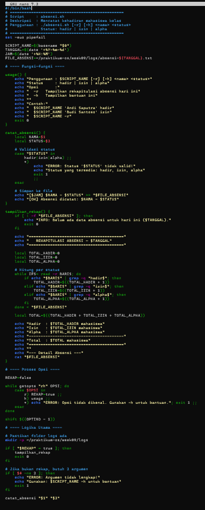
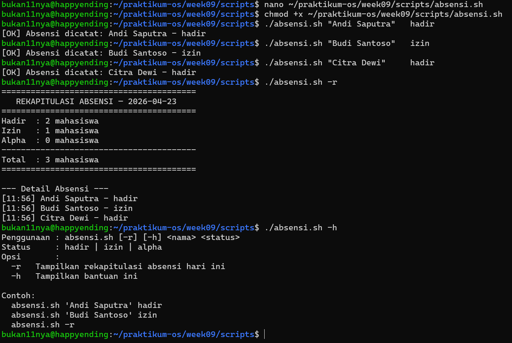
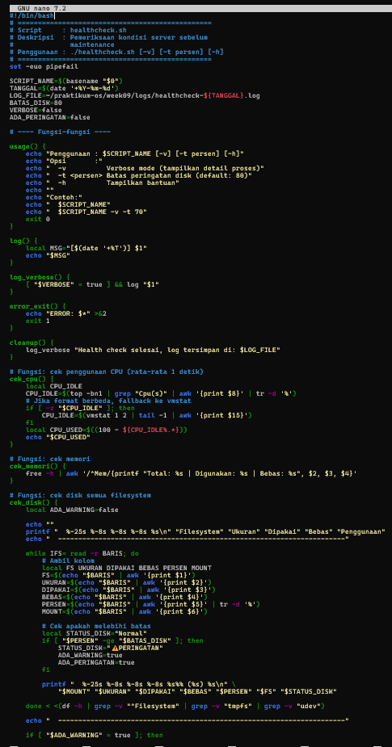
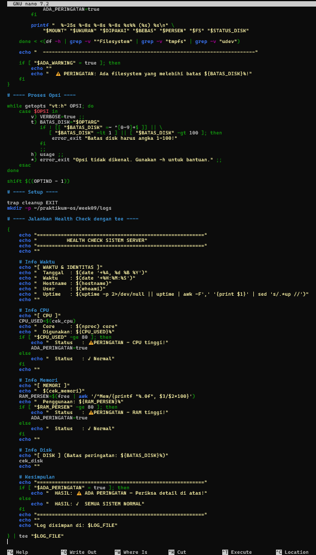
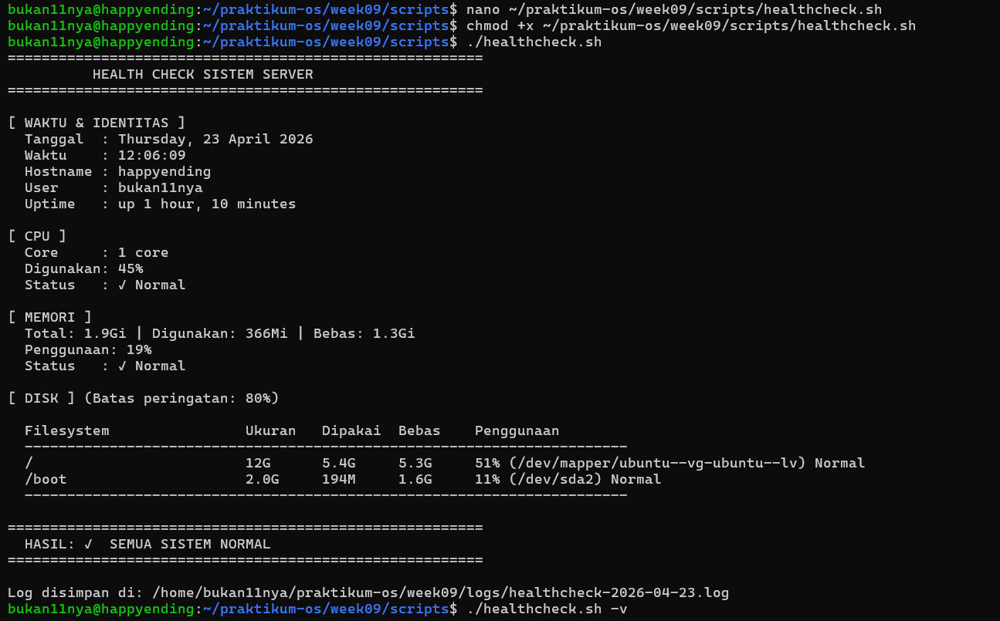
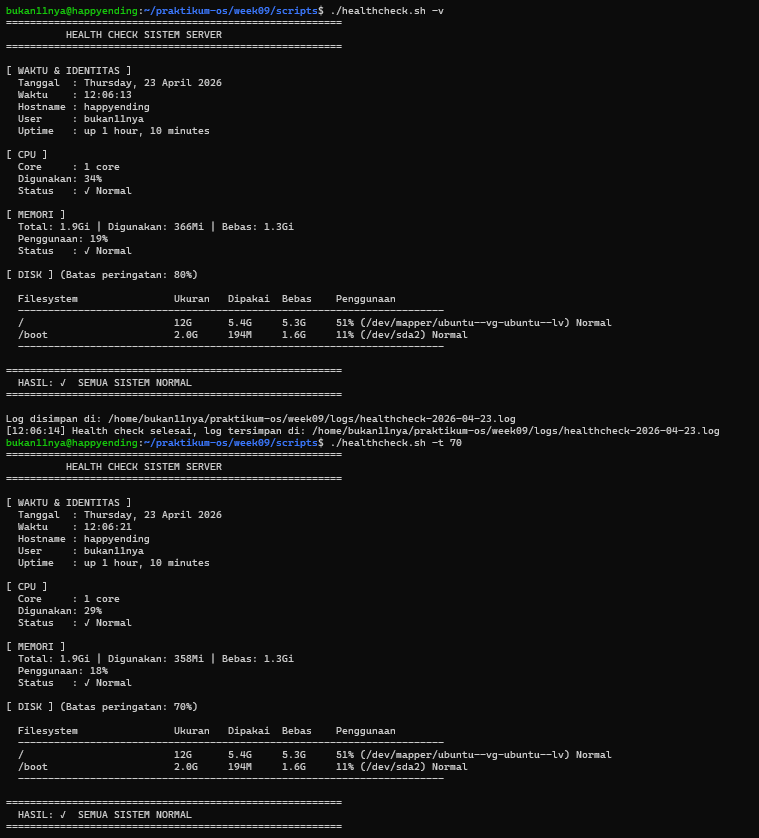

# **Laporan OS Pertemuan 9**

**Nama** : Rayhan Jofan Halim  
**NIM** : 254107020230  
**Kelas** : TI-1H  

---
## Praktikum 7.1 Script Pertama: Laporan Sistem
1. Buat workspace praktikum:

```mkdir -p ~/ praktikum - os / week09 /{ scripts , logs , data }```
```cd ~/ praktikum - os / week09 / scripts```

Kode 1.4: Menyiapkan workspace
```
bukan11nya@happyending:~$ mkdir -p ~/praktikum-os/week09/{scripts,logs,data}
bukan11nya@happyending:~$ cd ~/praktikum-os/week09/scripts
bukan11nya@happyending:~/praktikum-os/week09/scripts
```
2. Buat script dengan nano:

```nano laporan - sistem . sh```
```
bukan11nya@happyending:~/praktikum-os/week09/scripts$ nano laporan-sistem.sh
```
Kode 1.5: Membuka nano
3. Ketik isi berikut, simpan ( Ctrl+O Enter ), lalu keluar ( Ctrl+X ):
```
#!/bin/bash
# Script: laporan-sistem.sh
echo "================================"
echo "LAPORAN SISTEM"
echo "================================"
echo "Tanggal : $(date '+%A, %d %B %Y')"
echo "Jam     : $(date '+%H:%M:%S')"
echo "Hostname: $(hostname)"
echo "User    : $(whoami)"
echo "CPU core: $(nproc)"
echo "RAM bebas: $(free -h | awk '/^Mem/{print $4}')"
echo "Disk /  : $(df -h / | awk 'NR==2{print $5}') terpa>
echo "================================"
```
4. Beri izin dan jalankan:

```chmod + x laporan - sistem . sh ./ laporan - sistem . sh```

Kode 1.7: Menjalankan script
```
bukan11nya@happyending:~/praktikum-os/week09/scripts$ chmod +x laporan-sistem.sh
bukan11nya@happyending:~/praktikum-os/week09/scripts$ ./laporan-sistem.sh
================================
LAPORAN SISTEM
================================
Tanggal : Wednesday, 22 April 2026
Jam     : 05:30:38
Hostname: happyending
User    : bukan11nya
CPU core: 1
RAM bebas: 1.4Gi
Disk /  : 51% terpakai
================================
bukan11nya@happyending:~/praktikum-os/week09/scripts$
```
## Praktikum 7.2 Script Info Sistem dengan Argumen
Tujuan: berlatih variabel, substitusi perintah, parameter posisional, dan nilai default.
1. Buat script:
```nano ~/ praktikum - os / week09 / scripts / info - sistem . sh```
2. Ketik isi berikut:
```
#!/bin/bash
# Penggunaan: ./info-sistem.sh [nama-admin] [batas-disk-persen]

ADMIN=${1:-"Tidak dikenal"}
BATAS=${2:-80}
TANGGAL=$(date '+%F %T')
DISK_PERSEN=$(df / | awk 'NR==2{print $5}' | tr -d '%')

echo "Admin  : $ADMIN"
echo "Tanggal: $TANGGAL"
echo "Disk / : ${DISK_PERSEN}% terpakai"
echo "Batas  : ${BATAS}%"

if [ "$DISK_PERSEN" -gt "$BATAS" ]; then
    echo "STATUS: PERINGATAN - disk melebihi batas!"
else
    SISA=$((BATAS - DISK_PERSEN))
    echo "STATUS: Normal (sisa toleransi ${SISA}%)"
fi
```
3. Simpan, beri izin, uji dengan berbagai kombinasi argumen:
```
bukan11nya@happyending:~/praktikum-os/week09/scripts$ ./info-sistem.sh
Admin  : Tidak dikenal
Tanggal: 2026-04-22 05:42:44
Disk / : 51% terpakai
Batas  : 80%
STATUS: Normal (sisa toleransi 29%)
bukan11nya@happyending:~/praktikum-os/week09/scripts$ ./info-sistem.sh "Dian" 50
Admin  : Dian
Tanggal: 2026-04-22 05:42:53
Disk / : 51% terpakai
Batas  : 50%
STATUS: PERINGATAN - disk melebihi batas!
bukan11nya@happyending:~/praktikum-os/week09/scripts$ ./info-sistem.sh "Dian" 10
Admin  : Dian
Tanggal: 2026-04-22 05:43:02
Disk / : 51% terpakai
Batas  : 10%
STATUS: PERINGATAN - disk melebihi batas!
bukan11nya@happyending:~/praktikum-os/week09/scripts$
```
## Praktikum 7.3 Script Grading dan Menu Interaktif
Tujuan: menggabungkan if, for, while, dan case dalam satu session.
1. Buat script grading (menggunakan if dan for):
```
bukan11nya@happyending:~$ nano ~/praktikum-os/week09/scripts/grading-batch.sh
```
2. Ketik isi berikut:
```
#!/bin/bash
# Script: grading-batch.sh
# Proses daftar nilai mahasiswa

MAHASISWA=("Andi:92" "Budi:73" "Citra:55" "Deni:80" "Eka:45")

echo "=== HASIL GRADING ==="
for ENTRI in "${MAHASISWA[@]}"; do
    NAMA=$(echo "$ENTRI" | cut -d: -f1)
    NILAI=$(echo "$ENTRI" | cut -d: -f2)

    if   [ "$NILAI" -ge 85 ]; then GRADE="A"
    elif [ "$NILAI" -ge 75 ]; then GRADE="B"
    elif [ "$NILAI" -ge 65 ]; then GRADE="C"
    elif [ "$NILAI" -ge 55 ]; then GRADE="D"
    else GRADE="E"
    fi

    printf "%-10s %3d %s\n" "$NAMA" "$NILAI" "$GRADE"
done
echo "====================="
```
3. Simpan, beri izin, dan jalankan:
```
bukan11nya@happyending:~$ chmod +x ~/praktikum-os/week09/scripts/grading-batch.sh
bukan11nya@happyending:~/praktikum-os/week09/scripts$ ./grading-batch.sh
=== HASIL GRADING ===
Andi        92 A
Budi        73 C
Citra       55 D
Deni        80 B
Eka         45 E
=====================
```
4. Buat script menu interaktif (while + case):
```
bukan11nya@happyending:~/praktikum-os/week09/scripts$ nano ~/praktikum-os/week09/scripts/menu-sistem.sh
```
5. Ketik isi berikut:
```
#!/bin/bash
# Menu interaktif pemantauan sistem

while true; do
    echo ""
    echo "===== MENU MONITOR ====="
    echo "1) Info disk"
    echo "2) Info memori"
    echo "3) Proses teratas"
    echo "4) Keluar"
    echo -n "Pilih [1-4]: "
    read PILIHAN

    case $PILIHAN in
        1) df -h ;;
        2) free -h ;;
        3) ps aux --sort=-%cpu | head -6 ;;
        4) echo "Sampai jumpa!"; exit 0 ;;
        *) echo "Pilihan tidak valid." ;;
    esac
done
```
6. Beri izin dan jalankan, coba setiap opsi:
```
bukan11nya@happyending:~/praktikum-os/week09/scripts$ chmod +x ~/praktikum-os/week09/scripts/menu-sistem.sh
bukan11nya@happyending:~/praktikum-os/week09/scripts$ ./menu-sistem.sh

===== MENU MONITOR =====
1) Info disk
2) Info memori
3) Proses teratas
4) Keluar
Pilih [1-4]: 1
Filesystem                         Size  Used Avail Use% Mounted on
tmpfs                              197M  1.1M  196M   1% /run
/dev/mapper/ubuntu--vg-ubuntu--lv   12G  5.4G  5.3G  51% /
tmpfs                              985M     0  985M   0% /dev/shm
tmpfs                              5.0M     0  5.0M   0% /run/lock
/dev/sda2                          2.0G  194M  1.6G  11% /boot
tmpfs                              197M   12K  197M   1% /run/user/1000

===== MENU MONITOR =====
1) Info disk
2) Info memori
3) Proses teratas
4) Keluar
Pilih [1-4]: 2
               total        used        free      shared  buff/cache   available
Mem:           1.9Gi       370Mi       1.3Gi       1.1Mi       391Mi       1.6Gi
Swap:          2.0Gi          0B       2.0Gi

===== MENU MONITOR =====
1) Info disk
2) Info memori
3) Proses teratas
4) Keluar
Pilih [1-4]: 3
USER         PID %CPU %MEM    VSZ   RSS TTY      STAT START   TIME COMMAND
bukan11+    1199 50.0  0.2  10884  4596 pts/0    R+   11:09   0:00 ps aux --sort=-%cpu
bukan11+    1200 16.6  0.1   5696  2056 pts/0    S+   11:09   0:00 head -6
root        1111  4.5  2.1 616996 43872 ?        Ssl  11:05   0:11 /usr/libexec/fwupd/fwupd
root          55  2.0  0.0      0     0 ?        I    10:55   0:16 [kworker/0:2-events]
bukan11+    1081  0.9  0.3  15100  7140 ?        S    10:57   0:06 sshd: bukan11nya@pts/0

===== MENU MONITOR =====
1) Info disk
2) Info memori
3) Proses teratas
4) Keluar
Pilih [1-4]: 4
Sampai jumpa!
```
## Latihan 9.1
```Modifikasi laporan-sistem.sh agar menyimpan output ke file```
```laporan-YYYY-MM-DD.txt sekaligus menampilkannya di terminal. Petunjuk:```
gunakan tee yang sudah dipelajari di bab sebelumnya. 
```
#!/bin/bash
# Script: laporan-sistem.sh
# Latihan 9.1: output ke terminal DAN file menggunakan tee

TANGGAL_FILE=$(date '+%Y-%m-%d')
OUTPUT_FILE=~/praktikum-os/week09/logs/laporan-${TANGGAL_FILE}.txt

{
    echo "================================"
    echo "LAPORAN SISTEM"
    echo "================================"
    echo "Tanggal : $(date '+%A, %d %B %Y')"
    echo "Jam     : $(date '+%H:%M:%S')"
    echo "Hostname: $(hostname)"
    echo "User    : $(whoami)"
    echo "CPU core: $(nproc)"
    echo "RAM bebas: $(free -h | awk '/^Mem/{print $4}')"
    echo "Disk /  : $(df -h / | awk 'NR==2{print $5}') terpakai"
    echo "================================"
} | tee "$OUTPUT_FILE"

echo ""
echo "[INFO] Output disimpan ke: $OUTPUT_FILE"
```
Tampilan nya
```
bukan11nya@happyending:~/praktikum-os/week09/scripts$ chmod +x ~/praktikum-os/week09/scripts/laporan-sistem.sh
bukan11nya@happyending:~/praktikum-os/week09/scripts$ ./laporan-sistem.sh
================================
LAPORAN SISTEM
================================
Tanggal : Wednesday, 22 April 2026
Jam     : 05:37:03
Hostname: happyending
User    : bukan11nya
CPU core: 1
RAM bebas: 1.4Gi
Disk /  : 51% terpakai
================================
[INFO] Output disimpan ke: /home/bukan11nya/praktikum-os/week09/logs/laporan-2026-04-22.txt
bukan11nya@happyending:~/praktikum-os/week09/scripts$
#!/bin/bash
# Script: kalkulator.sh
```

## Latihan Latihan 9.2

 Buat script kalkulator.sh yang menerima tiga argumen:<angka1> <operator> <angka2> dengan operator +, -, *, atau /. Contoh:./kalkulator.sh 20 + 5 menghasilkan 25. Gunakan case untuk memilih operasi, dan validasi jika argumen tidak lengkap.

```
bukan11nya@happyending:~$ nano ~/praktikum-os/week09/scripts/kalkulator.sh
# Validasi jumlah argumen
if [ $# -ne 3 ]; then
    echo "ERROR: Argumen tidak lengkap!"
    echo "Penggunaan: $0 <angka1> <operator> <angka2>"
    echo "Operator  : + - * /"
    echo "Contoh    : $0 20 + 5"
    exit 1
fi

ANGKA1=$1
OPERATOR=$2
ANGKA2=$3

# Validasi angka1 dan angka2 harus berupa angka
if ! [[ "$ANGKA1" =~ ^-?[0-9]+$ ]]; then
    echo "ERROR: '$ANGKA1' bukan angka valid!"
    exit 1
fi

if ! [[ "$ANGKA2" =~ ^-?[0-9]+$ ]]; then
    echo "ERROR: '$ANGKA2' bukan angka valid!"
    exit 1
fi
# Proses operasi dengan case
bukan11nya@happyending:~/praktikum-os/week09/scripts$ chmod +x ~/praktikum-os/week09/scripts/kalkulator.sh
bukan11nya@happyending:~/praktikum-os/week09/scripts$ ./kalkulator.sh 20 + 5
================================
  20 + 5 = 25
================================
bukan11nya@happyending:~/praktikum-os/week09/scripts$ ./kalkulator.sh 20 - 5
================================
  20 - 5 = 15
================================
bukan11nya@happyending:~/praktikum-os/week09/scripts$ ./kalkulator.sh 20 "*" 5
================================
  20 * 5 = 100
================================
bukan11nya@happyending:~/praktikum-os/week09/scripts$ ./kalkulator.sh 20 / 5
================================
  20 / 5 = 4
================================
bukan11nya@happyending:~/praktikum-os/week09/scripts$ ./kalkulator.sh 20 / 0
ERROR: Tidak bisa membagi dengan nol!
bukan11nya@happyending:~/praktikum-os/week09/scripts$ ./kalkulator.sh 20 % 5
ERROR: Operator '%' tidak valid!
Operator yang tersedia: + - * /
bukan11nya@happyending:~/praktikum-os/week09/scripts$ ./kalkulator.sh 20 +
ERROR: Argumen tidak lengkap!
Penggunaan: ./kalkulator.sh <angka1> <operator> <angka2>
Operator  : + - * /
Contoh    : ./kalkulator.sh 20 + 5
```

## Latihan Latihan 9.3
Tambahkan ke script grading-batch.sh sebuah ringkasan di bagian bawah yang menampilkan: jumlah mahasiswa per grade (A, B, C, D,E) menggunakan perulangan for kedua yang mengiterasi array MAHASISWA
```
bukan11nya@happyending:~/praktikum-os/week09/scripts$ nano ~/praktikum-os/week09/scripts/grading-batch.sh
```

```
#!/bin/bash
# Script: grading-batch.sh
# Latihan 9.3: tambahkan ringkasan jumlah per grade

MAHASISWA=("Andi:92" "Budi:73" "Citra:55" "Deni:80" "Eka:45")

# Array untuk menyimpan grade tiap mahasiswa
DAFTAR_GRADE=()

echo "=== HASIL GRADING ==="
for ENTRI in "${MAHASISWA[@]}"; do
    NAMA=$(echo "$ENTRI" | cut -d: -f1)
    NILAI=$(echo "$ENTRI" | cut -d: -f2)

    if   [ "$NILAI" -ge 85 ]; then GRADE="A"
    elif [ "$NILAI" -ge 75 ]; then GRADE="B"
    elif [ "$NILAI" -ge 65 ]; then GRADE="C"
    elif [ "$NILAI" -ge 55 ]; then GRADE="D"
    else GRADE="E"
    fi

    printf "%-10s %3d %s\n" "$NAMA" "$NILAI" "$GRADE"

    # Simpan grade ke array
    DAFTAR_GRADE+=("$GRADE")
done
echo "====================="

# Ringkasan: hitung jumlah tiap grade
echo ""
echo "=== RINGKASAN GRADE ==="
for TARGET_GRADE in A B C D E; do
    JUMLAH=0
    for GRADE in "${DAFTAR_GRADE[@]}"; do
        if [ "$GRADE" = "$TARGET_GRADE" ]; then
            JUMLAH=$((JUMLAH + 1))
            fi
    done
    printf "Grade %s : %d mahasiswa\n" "$TARGET_GRADE" "$JUMLAH"
done
echo "======================="
echo "Total    : ${#MAHASISWA[@]} mahasiswa"
```
```
bukan11nya@happyending:~/praktikum-os/week09/scripts$ chmod +x ~/praktikum-os/week09/scripts/grading-batch.sh
bukan11nya@happyending:~/praktikum-os/week09/scripts$ ./grading-batch.sh
=== HASIL GRADING ===
Andi        92 A
Budi        73 C
Citra       55 D
Deni        80 B
Eka         45 E
=====================
```
## Latihan 9.4
Tambahkan fungsi konfirmasi() ke lib-validasi.sh. Fungsi ini
menampilkan pertanyaan, membaca input Y/N dari user, mengembalikan
0 jika Y dan 1 jika N. Buat script demo yang memanggil fungsi ini sebelum
menghapus sebuah file.

```
bukan11nya@happyending:~/praktikum-os/week09/scripts$ nano ~/praktikum-os/week09/scripts/lib-validasi.sh
bukan11nya@happyending:~/praktikum-os/week09/scripts$ nano ~/praktikum-os/week09/scripts/demo-hapus.sh
```
```
#!/bin/bash
# lib-validasi.sh - Library fungsi validasi
# Latihan 9.4: tambah fungsi konfirmasi()

adalah_angka() {
    [[ "$1" =~ ^[0-9]+$ ]]
}

file_bisa_dibaca() {
    [ -f "$1" ] && [ -r "$1" ]
}

error_exit() {
    echo "ERROR: $1" >&2
    exit 1
}

info()   { echo "[INFO] $1"; }
sukses() { echo "[OK] $1"; }

# Fungsi konfirmasi: tampilkan pertanyaan Y/N
# Return 0 jika Y, return 1 jika N
konfirmasi() {
    local PERTANYAAN="${1:-Apakah Anda yakin?}"
    local JAWABAN
    
    while true; do
        echo -n "$PERTANYAAN [Y/N]: "
        read JAWABAN

        case "$JAWABAN" in
            Y|y|yes|YES)
                return 0
                ;;
            N|n|no|NO)
                return 1
                ;;
            *)
                echo "  Jawaban tidak valid. Ketik Y atau N."
                ;;
        esac
    done
}
```
```
#!/bin/bash
# Script: demo-hapus.sh
# Latihan 9.4: demo penggunaan fungsi konfirmasi sebelum hapus file

source ~/praktikum-os/week09/scripts/lib-validasi.sh

# Validasi argumen
if [ $# -ne 1 ]; then
    echo "Penggunaan: $0 <path-file>"
    exit 1
fi

FILE=$1

# Cek apakah file ada
if [ ! -f "$FILE" ]; then
    error_exit "File '$FILE' tidak ditemukan!"
fi

# Tampilkan info file
info "File yang akan dihapus: $FILE"
info "Ukuran: $(du -sh "$FILE" | cut -f1)"

# Konfirmasi sebelum hapus
if konfirmasi "Hapus file '$FILE'?"; then
    rm "$FILE"
    sukses "File '$FILE' berhasil dihapus."
else
    info "Penghapusan dibatalkan."
    exit 0
fi
```
```
bukan11nya@happyending:~/praktikum-os/week09/scripts$ echo "ini file uji" > ~/praktikum-os/week09/data/file-uji.txt
bukan11nya@happyending:~/praktikum-os/week09/scripts$ ./demo-hapus.sh ~/praktikum-os/week09/data/file-uji.txt
[INFO] File yang akan dihapus: /home/bukan11nya/praktikum-os/week09/data/file-uji.txt
[INFO] Ukuran: 4.0K
Hapus file '/home/bukan11nya/praktikum-os/week09/data/file-uji.txt'? [Y/N]: Y
[OK] File '/home/bukan11nya/praktikum-os/week09/data/file-uji.txt' berhasil dihapus.
```

## Latihan 9.5

Script debug-latihan.sh tidak menangani direktori yang tidak ada. Perbaiki dengan menambahkan:

• set -e di baris kedua

• Pengecekan -d "$DIREKTORI" sebelum memanggil du

• Pesan error yang informatif jika direktori tidak ditemukan

Uji dengan direktori yang tidak ada.

### Modifikasi Pada Praktikum 7.6
```
#!/bin/bash
# Script: debug-latihan.sh
# Latihan 9.5: tambah set -e, cek direktori, pesan error informatif

set -e   # keluar otomatis jika ada perintah gagal

# Validasi jumlah argumen
if [ $# -ne 2 ]; then
    echo "Penggunaan: $0 <direktori> <batas-MB>"
    echo "Contoh   : $0 /etc 10"
    exit 1
fi

DIREKTORI=$1
BATAS=$2

# Validasi direktori ada
if [ ! -d "$DIREKTORI" ]; then
    echo "ERROR: Direktori '$DIREKTORI' tidak ditemukan!"
    echo "Pastikan path direktori benar dan direktori tersebut ada."
    exit 2
fi

# Validasi batas harus angka
if ! [[ "$BATAS" =~ ^[0-9]+$ ]]; then
    echo "ERROR: Batas '$BATAS' harus berupa angka positif!"
    exit 3
fi

UKURAN=$(du -sm "$DIREKTORI" | cut -f1)

echo "================================"
echo "Direktori: $DIREKTORI"
echo "Ukuran   : ${UKURAN} MB"
echo "Batas    : ${BATAS} MB"
echo "================================"

if [ "$UKURAN" -gt "$BATAS" ]; then
    echo "STATUS   : ⚠ PERINGATAN - Ukuran melebihi batas!"
    echo "Kelebihan: $((UKURAN - BATAS)) MB"
else
    echo "STATUS   : ✓ Normal (sisa: $((BATAS - UKURAN)) MB)"
fi
```
### Cara Menampilkan & Hasilnya
```
bukan11nya@happyending:~$ chmod +x ~/praktikum-os/week09/scripts/debug-latihan.sh
bukan11nya@happyending:~$ ./debug-latihan.sh /etc 100
-bash: ./debug-latihan.sh: No such file or directory
bukan11nya@happyending:~$ cd ~/praktikum-os/week09/scripts
bukan11nya@happyending:~/praktikum-os/week09/scripts$ ./debug-latihan.sh /etc 100
du: cannot read directory '/etc/ssl/private': Permission denied
du: cannot read directory '/etc/multipath': Permission denied
du: cannot read directory '/etc/credstore.encrypted': Permission denied
du: cannot read directory '/etc/polkit-1/rules.d': Permission denied
du: cannot read directory '/etc/credstore': Permission denied
================================
Direktori: /etc
Ukuran   : 7 MB
Batas    : 100 MB
================================
STATUS   : ✓ Normal (sisa: 93 MB)
bukan11nya@happyending:~/praktikum-os/week09/scripts$ ./debug-latihan.sh /etc 5
du: cannot read directory '/etc/ssl/private': Permission denied
du: cannot read directory '/etc/multipath': Permission denied
du: cannot read directory '/etc/credstore.encrypted': Permission denied
du: cannot read directory '/etc/polkit-1/rules.d': Permission denied
du: cannot read directory '/etc/credstore': Permission denied
================================
Direktori: /etc
Ukuran   : 7 MB
Batas    : 5 MB
================================
STATUS   : ⚠ PERINGATAN - Ukuran melebihi batas!
Kelebihan: 2 MB
bukan11nya@happyending:~/praktikum-os/week09/scripts$ ./debug-latihan.sh /direktori-tidak-ada 10
ERROR: Direktori '/direktori-tidak-ada' tidak ditemukan!
Pastikan path direktori benar dan direktori tersebut ada.
bukan11nya@happyending:~/praktikum-os/week09/scripts$ ./debug-latihan.sh /etc abc
ERROR: Batas 'abc' harus berupa angka positif!
bukan11nya@happyending:~/praktikum-os/week09/scripts$ ./debug-latihan.sh
Penggunaan: ./debug-latihan.sh <direktori> <batas-MB>
Contoh   : ./debug-latihan.sh /etc 10
```

# 1.8 Tugas Praktikum

## Tugas 1 

Script Absensi Kelas
Konteks: instruktur mencatat kehadiran mahasiswa dari command line.
Instruksi:
1. Buat script absensi.sh yang:

• Menerima argumen nama mahasiswa dan status (hadir/izin/alpha)

• Menyimpan entri ke absensi-YYYY-MM-DD.txt dengan format [HH:MM]
NAMA - STATUS

• Opsi -r: tampilkan rekapitulasi (jumlah per status)

• Opsi -h: tampilkan bantuan

2. Rekam minimal 5 entri dan tampilkan rekapitulasinya.
Konsep wajib: variabel, parameter posisional, getopts, if, for, fungsi, dan
redirection ke file.

### Input :


### Output :


## Tugas 2

Script Health Check Sistem
Konteks: administrator membuat pemeriksaan kondisi server sebelum maintenance.
Instruksi:
1. Buat script healthcheck.sh menggunakan template profesional dari bagian
Best Practices.
2. Script menampilkan: tanggal/waktu, hostname, uptime, penggunaan CPU,
memori, dan disk untuk setiap filesystem yang terpasang.
3. Jika penggunaan disk mana pun melebihi 80%, tampilkan peringatan.
4. Simpan hasil ke healthcheck-YYYY-MM-DD.log dan tampilkan ke terminal
sekaligus menggunakan tee.
5. Opsi -t <persen> mengubah batas peringatan disk (default 80).
Konsep wajib: set -euo pipefail, trap, getopts, fungsi dengan local,
for, if, dan tee.

## Input :




## Output :




