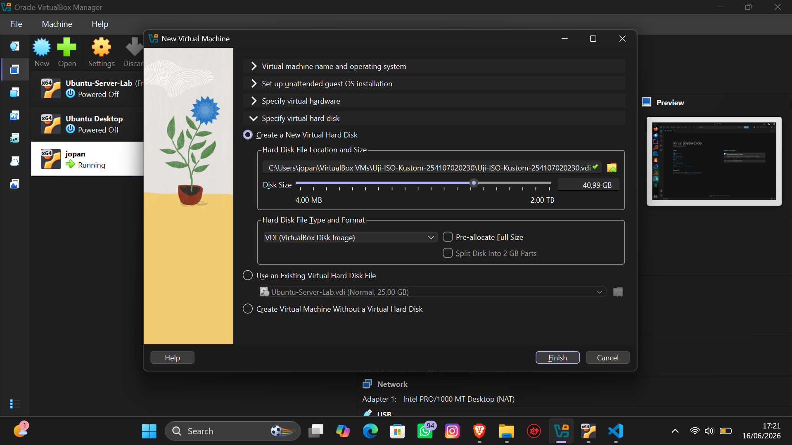

# **Laporan Remastering Sistem Operasi Linux (CUBIC)**

**Nama** : Rayhan Jofan Halim  
**NIM** : 254107020230  
**Kelas** : TI-1H  

## Setelah Menginstall Aplikasi Dan Kustomisasi Tampilan (Antarmuka) Menggunakan Cubic

## 1. Langkah Pengujian ISO Kustom di VirtualBox

Buka VirtualBox dan klik tombol New untuk membuat mesin virtual baru, Isi Data VM:

Name: Ubah sesuai nama tugasmu (misalnya: Uji-ISO-Kustom).
ISO Image: Klik panah drop-down, pilih Other..., lalu cari dan pilih file ISO kustom yang sudah kamu buat.

Alokasikan Sumber Daya: * Berikan RAM minimal 2 GB (2048 MB) atau lebih tinggi agar lancar.
Berikan CPU minimal 2 Cores.

Hard Disk: Buat virtual hard disk baru (minimal 25 GB jika ingin sekalian melakukan instalasi).

Jalankan VM: Klik Start. Jalankan sistem dalam mode Live CD (Try Ubuntu) atau lakukan instalasi penuh untuk melihat perubahan visualnya.

## Tampilan Utama Desktop yang telah diubah visualnya (Wallpaper, Theme, Dan Icon).

## Menampilkan Spesifikasi Mesin Virtual Ubuntu

## Pengujian Membuka Aplikasi Visual Studio Code

## Pengujian Membuka VLC Media Player

## Pengujian membuka GIMP

## Pengujian Apache2 dan PHP

## Pengecekan Apakah Apache2 dan PHP Sudah Saling Terhubung

